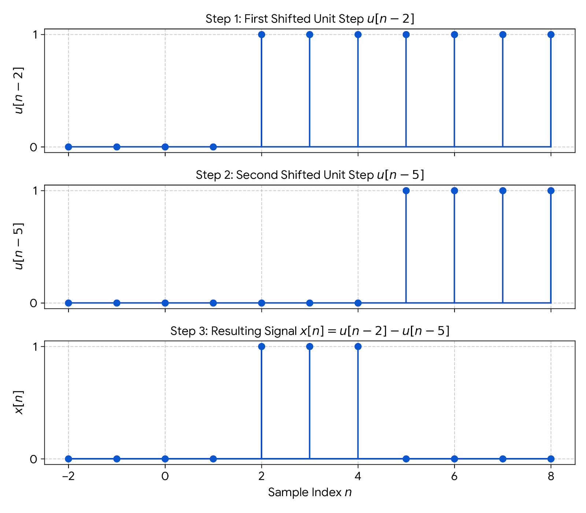

# Digital Signal Processing (DSP) - Session 2

## I. Introduction

### 1. The Concept of Frequency in Continuous-Time and Discrete-Time Signals

#### 1.1. Continuous-Time Sinusoidal Signals

A simple harmonic oscillation is mathematically described by a continuous-time sinusoidal signal. A continuous-time sinusoid is completely characterized by three parameters: amplitude ($A$), frequency ($\Omega$ or $F$), and phase ($\theta$).

**General Expression (Radians):**

$$  
x(t)=A\cos(\Omega t+\theta),  
\qquad -\infty<t<\infty  
$$

where

- $A$ is the amplitude.
- $\Omega$ is the angular frequency in **radians per second (rad/s)**.
- $t$ is time in **seconds**.
- $\theta$ is the phase in **radians**.

**Frequency Relation:**

$$  
\Omega = 2\pi F  
$$

where

- $F$ is the frequency in **cycles per second (Hz)**.

**General Expression (Hertz):**

$$  
x(t)=A\cos(2\pi Ft+\theta),  
\qquad -\infty<t<\infty  
$$

**Periodicity:** For every fixed value of $F$, the signal is periodic.

$$  
x(t+T)=x(t)  
$$

The fundamental period is $T=1/F$.

**Uniqueness:** Continuous-time sinusoidal signals with distinct frequencies are distinct.

**Rate of Oscillation:** Increasing $F$ increases the rate of oscillation (more cycles within a given time interval). Since time is continuous, the frequency $F$ can increase without bound.

**Complex Exponential Form and Phasors:**

$$  
x(t)
=
Ae^{j(\Omega t+\theta)}  
$$

Sinusoidal signals are closely related to complex exponential signals through **Euler's identity**:

$$  
e^{j\phi}
=
\cos\phi  
+  
j\sin\phi  
$$

A real sinusoidal signal can be expressed as the sum of two equal-amplitude complex-conjugate exponentials:

$$  
x(t)
=
A\cos(\Omega t+\theta)
=
\frac{A}{2}e^{j(\Omega t+\theta)}  
+  
\frac{A}{2}e^{-j(\Omega t+\theta)}  
$$

**Frequency Range:** Although physical frequency is nonnegative, both positive and negative frequencies are used for mathematical convenience.

$$  
-\infty<F<\infty  
$$

#### 1.2. Discrete-Time Sinusoidal Signals

A discrete-time sinusoidal signal is a sequence of numbers derived from a function of an integer variable $n$.

**General Expression (Radians):**

$$  
x[n]=A\cos(\omega n+\theta),  
\qquad -\infty<n<\infty  
$$

where

- $A$ is the amplitude.
- $\omega$ is the angular frequency in **radians per sample**.
- $n$ is the **sample index** (an integer).
- $\theta$ is the phase in **radians**.

**Frequency Relation:**

$$  
\omega=2\pi f  
$$

where

- $f$ is the frequency in **cycles per sample**.

**General Expression (Cycles):**

$$  
x[n]=A\cos(2\pi fn+\theta),  
\qquad -\infty<n<\infty  
$$

**Periodicity:** A discrete-time sinusoid is periodic **only if** its normalized frequency $f$ is a **rational number**. A signal is periodic with period $N$ ($N>0$) if

$$  
x[n+N]=x[n]
$$

This requires $f_0=k/N$ where $k$ and $N$ are integers. The fundamental period is obtained by expressing $f_0$ as a reduced fraction $k/N$, where $k$ and $N$ are relatively prime.

**Uniqueness and Aliasing:** Discrete-time sinusoids whose frequencies differ by an integer multiple of $2\pi$ are identical.

$$  
\cos\!\left[(\omega_0+2\pi)n+\theta\right]
=
\cos\!\left(\omega_0n+2\pi n+\theta\right)
=
\cos(\omega_0n+\theta)  
$$

Therefore, every frequency outside the principal interval is an **alias** of a frequency inside it.

The unique frequency ranges are commonly chosen as $-\pi\le\omega\le\pi$ or equivalently $-\frac12\le f\le\frac12$.

**Highest Rate of Oscillation:** The highest rate of oscillation occurs at $\omega=\pi$ or $\omega=-\pi$. This corresponds to $f=\frac12$ or $f=-\frac12$.

Observations:

- Increasing $\omega$ from $0$ to $\pi$ increases the rate of oscillation.
- Increasing $\omega$ from $\pi$ to $2\pi$ decreases the apparent rate of oscillation because of aliasing.

**Complex Exponential Form:** Using Euler's identity, a discrete-time sinusoid can be expressed as the sum of two complex-conjugate exponentials:

$$  
x[n]
=
A\cos(\omega n+\theta)
=
\frac{A}{2}e^{j(\omega n+\theta)}  
+  
\frac{A}{2}e^{-j(\omega n+\theta)}  
$$

**Frequency Range:** Unlike continuous-time sinusoids, discrete-time frequencies repeat every $2\pi$. The frequency axis is periodic with period $2\pi$.

Two commonly used principal frequency intervals are $0\le\omega\le2\pi$ and $-\pi\le\omega\le\pi$.

### 2. Analog-to-Digital Conversion (ADC)

#### 2.1. Basic parts

- Goal: convert a continuous-time, continuous-amplitude signal into a discrete-time, discrete-amplitude sequence.
- Typical chain: **anti-aliasing filter** → **sampling** → **quantization** → **encoding**.

1. Sampling
    - Sample at rate $f_s$ samples/second (sampling period $T_s=1/f_s$):
        
        $$  
        x[n]=x_a(nT_s)  
        $$
        
    - Sampling a signal multiplies it by an impulse train in time, which creates **spectral replicas** in frequency.
        
    - In discrete-time, the corresponding digital frequency is $\omega = 2\pi f/f_s$.
        
2. Quantization
    - Rounds each sample to the nearest value on a finite set of amplitude levels.
        
    - Quantization step size (uniform quantizer):
        
        $$  
        \Delta = \frac{V_{\max}-V_{\min}}{2^B}  
        $$
        
        where $B$ is number of bits.
        
    - Quantization error:
        
        $$  
        e_q[n]=x[n]-x_q[n].  
        $$
        
3. Encoding
    - Maps each quantized level to a binary word of length $B$.
    - Bit rate (for one channel): $R = B\,f_s$ bits/second.

#### 2.2. Nyquist–Shannon sampling theorem & Aliasing

- If a continuous-time signal is bandlimited to $|f|\le B$ Hz, then perfect reconstruction is possible when $f_s \ge 2B$ (Nyquist rate).
- If $f_s < 2B$, spectral replicas overlap → **aliasing**, meaning high-frequency content folds into lower frequencies.
- Practical note: because real signals are not perfectly bandlimited, we usually use an **anti-aliasing low-pass filter** before sampling.

#### 2.3. Signal-to-quantization noise ratio (SQNR)

- SQNR measures the ratio of signal power to quantization-noise power:
    
    $$  
    \text{SQNR}=\frac{P_{\text{signal}}}{P_{\text{quant}}}=\frac{3}{2}\cdot 2^{2B}  
    $$
    
- SQNR is also often expressed in decibels (dB):
    

$$  
\text{SQNR}_{\text{dB}}=10\log_{10}(\text{SQNR}) \approx 1.76 + 6.02B  
$$

*Tip (logarithmic scale / dB):* Use a log scale when quantities span many orders of magnitude (very large or very small).

- **Power ratio (dB):** $P_{\mathrm{dB}} = 10\log_{10}\!\left(\frac{P_2}{P_1}\right)$
- **Amplitude ratio (dB):** $A_{\mathrm{dB}} = 20\log_{10}\!\left(\frac{A_2}{A_1}\right)$ (because $P \propto A^2$)

## II. Discrete-Time Signals

### 1. Representations

Discrete-time signals $x[n]$ are defined only for integer values of the independent variable $n \in \mathbb{Z}$. They can be represented in four standard forms:

* **Graphical:** A stem plot displaying sample values (amplitudes) as discrete vertical lines plotted against integer indices $n$.
* **Functional:** A piecewise or closed-form mathematical expression defining $x[n]$ for all $n$.
  * *Example:* $x[n] = 2^n u[n]$
* **Tabular:** A table listing discrete sample values directly corresponding to specific values of $n$.
* **Sequence (Vector):** An ordered set of numbers enclosed in brackets, where an arrow or bold term indicates the sample index $n = 0$.
  * *Example:* $x[n] = \{\dots, 0, \underset{\uparrow}{2}, 1, 3, 0, \dots\}$ (the arrow highlights $x[0] = 2$).

### 2. Some Elementary Discrete-Time Signals

#### 2.1. Unit Sample Signal (Impulse Signal)
Defines a single isolated spike of unit amplitude at $n = 0$:

$$  
\delta[n] = \begin{cases} 1, & \text{if } n = 0 \\ 0, & \text{if } n \neq 0 \end{cases}  
$$

#### 2.2. Unit Step Signal
Represents a signal that gets activated at $n = 0$ with constant unit amplitude:

$$  
u[n] = \begin{cases} 1, & \text{if } n \ge 0 \\ 0, & \text{if } n < 0 \end{cases}  
$$

* *Relationship to Impulse:*

$$
u[n] = \sum_{k=-\infty}^{n} \delta[k] = \sum_{k=0}^{\infty} \delta[n-k]
$$

#### 2.3. Unit Ramp Signal
A signal that grows linearly with sample index $n$ for non-negative time:

$$  
r[n] = \begin{cases} n, & \text{if } n \ge 0 \\ 0, & \text{if } n < 0 \end{cases}  
$$

* *Relationship to Unit Step:*

$$
r[n] = n \cdot u[n]
$$

#### 2.4. Exponential Signals
General discrete-time exponential signals take the form $x[n] = a^n$:

* **Real Exponential ($x[n] = a^n$, where $a \in \mathbb{R}$):**
  * $|a| > 1$: Growing exponential.
  * $|a| < 1$: Decaying exponential.
  * $a < 0$: Alternating signs between positive and negative samples.
* **Complex Exponential ($x[n] = e^{j\omega_0 n}$):**
  * Expressed via Euler's formula: $e^{j\omega_0 n} = \cos(\omega_0 n) + j \sin(\omega_0 n)$.
  * Unlike continuous complex exponentials, discrete complex exponentials are **periodic only if** $\frac{\omega_0}{2\pi}$ is a rational number.

*Example:* Sketch the graph of this signal:

$$  
x[n]=u[n-2]-u[n-5]  
$$

```python
import numpy as np
import matplotlib.pyplot as plt

# Define the index range
n = np.arange(-2, 9)

# Define step function u[n]
def u(n):
    return np.where(n >= 0, 1, 0)

# Signals
u_n2 = u(n - 2)
u_n5 = u(n - 5)
x_n = u_n2 - u_n5

# Plot step-by-step
fig, axes = plt.subplots(3, 1, figsize=(8, 7), sharex=True)

# Plot 1: u[n-2]
axes[0].stem(n, u_n2, basefmt="C0-")
axes[0].set_ylabel('$u[n-2]$', fontsize=12)
axes[0].set_title('Step 1: First Shifted Unit Step $u[n-2]$', fontsize=12)
axes[0].set_yticks([0, 1])
axes[0].grid(True, linestyle='--', alpha=0.6)

# Plot 2: u[n-5]
axes[1].stem(n, u_n5, basefmt="C0-")
axes[1].set_ylabel('$u[n-5]$', fontsize=12)
axes[1].set_title('Step 2: Second Shifted Unit Step $u[n-5]$', fontsize=12)
axes[1].set_yticks([0, 1])
axes[1].grid(True, linestyle='--', alpha=0.6)

# Plot 3: x[n] = u[n-2] - u[n-5]
axes[2].stem(n, x_n, basefmt="C0-")
axes[2].set_ylabel('$x[n]$', fontsize=12)
axes[2].set_xlabel('Sample Index $n$', fontsize=12)
axes[2].set_title('Step 3: Resulting Signal $x[n] = u[n-2] - u[n-5]$', fontsize=12)
axes[2].set_yticks([0, 1])
axes[2].grid(True, linestyle='--', alpha=0.6)

plt.tight_layout()
plt.savefig("signal_visualization.png", dpi=300)
plt.show()

print("Signal values x[n]:")
for ni, val in zip(n, x_n):
    print(f"n={ni:2d} : {val}")
```



### 3. Classification of discrete-time signals

#### 3.1. Energy signals and power signals

- **Total Energy:**

$$  
E=\sum_{n=-\infty}^{\infty}|x[n]|^2  
$$

- **Average Power:**

$$  
P=\lim_{N\to\infty}  
\frac{1}{2N+1}  
\sum_{n=-N}^{N}|x[n]|^2  
$$

- An **energy signal** has a **finite, non-zero total energy** ($0 < E < \infty$), which forces its average power to be **zero** ($P = 0$).
- A **power signal** has a **finite, non-zero average power** ($0 < P < \infty$), which means its total energy is **infinite** ($E = \infty$).
- Signals that grow infinitely over time are neither energy nor power signals ($E = \infty, P = \infty$).

*Example:*

- Unit Sample Signal $\delta[n]$:
	- **Total Energy ($E$):**
	    $$E = \sum_{n=-\infty}^{\infty} \vert{}\delta[n]\vert{}^2 = \vert{}\delta[0]\vert{}^2 = 1^2 = 1$$
	- **Average Power ($P$):**
		$$P = \lim_{N\to\infty} \frac{1}{2N+1} \sum_{n=-N}^{N} \vert{}\delta[n]\vert{}^2 = \lim_{N\to\infty} \frac{1}{2N+1} (1) = 0$$
	Since $0 < E < \infty$ and $P = 0$, **$\delta[n]$ is an energy signal**.
- Unit Step Signal $u[n]$:
	- **Total Energy ($E$):**
	    
	    $$E = \sum_{n=-\infty}^{\infty} \vert{}u[n]\vert{}^2 = \sum_{n=0}^{\infty} 1^2 = 1 + 1 + 1 + \dots = +\infty$$
	    
	    Because energy is infinite, $u[n]$ cannot be an energy signal.
	    
	- **Average Power ($P$):**
	    
	    In the interval $[-N, N]$, the signal is $1$ only for $n = 0, 1, 2, \dots, N$ (which contains $N + 1$ active samples):
	    
	    $$P = \lim_{N\to\infty} \frac{1}{2N+1} \sum_{n=0}^{N} 1 = \lim_{N\to\infty} \frac{N+1}{2N+1}$$
	    
	    Dividing numerator and denominator by $N$:
	    
	    $$P = \lim_{N\to\infty} \frac{1 + 1/N}{2 + 1/N} = \frac{1 + 0}{2 + 0} = \frac{1}{2}$$
	    
	    Since $0 < P < \infty$, **$u[n]$ is a power signal**.

#### 3.2. Periodic signals and aperiodic signals

- A signal $x[n]$ is periodic if there exists a positive integer fundamental period $N \in \mathbb{Z}^+$ such that $x[n + N] = x[n]$ for all integer indices $n$.
- The smallest positive integer $N$ satisfying this condition is called the **fundamental period**.
- If no such integer $N$ exists, the signal is aperiodic.
- All periodic signals with non-zero values over an infinite duration are **power signals**.
- For discrete complex exponentials $x[n] = e^{j\omega_0 n}$ or sinusoids $x[n] = \cos(\omega_0 n)$, periodicity requires that $\frac{\omega_0}{2\pi} = \frac{k}{N}$ (a rational ratio), where the fundamental period is $N = \frac{2\pi k}{\omega_0}$.

#### 3.3. Symmetric (even) and antisymmetric (odd) signals

- A signal is **even (symmetric)** if $x[-n] = x[n]$ for all $n$ (reflection across the vertical axis $n = 0$).
- A signal is **odd (antisymmetric)** if $x[-n] = -x[n]$ for all $n$ (forces $x[0] = 0$).
- **Decomposition:** Any arbitrary discrete-time signal $x[n]$ can be uniquely split into a sum of its even part $x_e[n]$ and odd part $x_o[n]$:
  $$x[n] = x_e[n] + x_o[n]$$
  where:
  $$x_e[n] = \frac{1}{2}(x[n] + x[-n])$$
  $$x_o[n] = \frac{1}{2}(x[n] - x[-n])$$

### 4. Simple Manipulations of Discrete-Time Signals

#### 4.1. Time Shifting & Time Reversal

$$
x[\pm n \pm a], a \in \mathbb{N}
$$

- **Time Shifting ($x[n \pm a]$):** Moving the signal along the time axis without changing its shape.
  - $x[n - a]$ delays (shifts right) the signal by $a$ units.
  - $x[n + a]$ advances (shifts left) the signal by $a$ units.
- **Time Reversal / Folding ($x[-n]$):** Reflects the signal about $n = 0$.
- **Combined Shift & Reversal ($x[-n \pm a]$):** Order of operations matters:
  - First shift $x[n]$ to get $x[n \pm a]$, then reverse time $n \to -n$ to get $x[-n \pm a]$.
  - Alternatively, factor as $x[-(n \mp a)]$: first fold $x[n] \to x[-n]$, then shift in the direction dictated by the factored sign.

#### 4.2. Up-sampling & Down-sampling

$$
x[cn], c \in \mathbb{N}
$$

- **Down-sampling / Decimation ($x[cn], c \in \mathbb{N}, c > 1$):**
  - Keeps every $c$-th sample and discards the rest ($c-1$ samples dropped between kept samples).
  - Shrinks/compresses the signal in time domain and leads to spectrum expansion in frequency domain (potential aliasing if not pre-filtered).
- **Up-sampling / Interpolation ($c \in \mathbb{N}, c > 1$):**
  - Expressed as $x_u[n] = \begin{cases} x[n/c], & \text{if } n \text{ is a multiple of } c \\ 0, & \text{otherwise} \end{cases}$
  - Inserts $c - 1$ zero-valued samples between consecutive original samples, expanding the signal in the time domain.

## III. Discrete-Time Systems

### 1. Representations

#### 1.1. Input-Output Description of Systems
- A discrete-time system operates on an input sequence $x[n]$ to produce an output sequence $y[n]$, represented as $y[n] = \mathcal{T}\{x[n]\}$.
- Systems are represented by difference equations: Linear constant-coefficient difference equations (LCCDE) relate the current output to past outputs and current/past inputs:
  $$\sum_{k=0}^{N} a_k y[n-k] = \sum_{m=0}^{M} b_m x[n-m]$$

#### 1.2. Block Diagram Representation of Discrete-Time Systems
- Constructed using three basic functional building blocks:
  - **Adder:** Adds two signals, $y[n] = x_1[n] + x_2[n]$.
  - **Constant Multiplier (Gain):** Scales a signal by a constant, $y[n] = a \cdot x[n]$.
  - **Unit Delay Element ($z^{-1}$):** Delays a signal by one sample, $y[n] = x[n-1]$. (A unit advance $z$ yields $x[n+1]$).

### 2. Classification of Discrete-Time Systems

#### 2.1. Static vs dynamic systems
- **Static (Memoryless):** The output $y[n]$ at index $n$ depends *only* on the input $x[n]$ at that same index $n$ (e.g., $y[n] = C x^2[n]$).
- **Dynamic (With Memory):** The output $y[n]$ depends on past or future values of the input or output (e.g., $y[n] = x[n] + x[n-1]$).

#### 2.2. Time-invariant vs time-variant systems
- **Time-Invariant (Shift-Invariant):** A time shift in the input causes an identical time shift in the output: if $\mathcal{T}\{x[n]\} = y[n]$, then $\mathcal{T}\{x[n-k]\} = y[n-k]$ for all integer $k$.
- **Time-Variant:** The system's input-output relationship changes over time (e.g., coefficients depend on $n$, as in $y[n] = n \cdot x[n]$, or time operations occur, as in $y[n] = x[-n]$).

#### 2.3. Linear vs nonlinear systems
- **Linear:** Satisfies the principle of **superposition** (both additivity and homogeneity):
  $$\mathcal{T}\{a \cdot x_1[n] + b \cdot x_2[n]\} = a \cdot \mathcal{T}\{x_1[n]\} + b \cdot \mathcal{T}\{x_2[n]\}$$
- **Nonlinear:** Fails superposition (e.g., contains powers, square roots, absolute values, or non-zero initial conditions like $y[n] = x^2[n]$ or $y[n] = x[n] + 3$).

#### 2.4. Causal vs non-causal systems
- **Causal:** The output $y[n]$ at any index $n$ depends *only* on present and/or past inputs $x[k]$ ($k \le n$). It cannot depend on future inputs.
- **Non-Causal:** The output $y[n]$ depends on future input samples $x[k]$ ($k > n$) (e.g., $y[n] = x[n+1]$). Non-causal systems cannot be implemented in real time, but can process pre-recorded data.

#### 2.5. Stable vs unstable systems
- **BIBO Stable (Bounded-Input, Bounded-Output):** Every bounded input $|x[n]| \le M_x < \infty$ produces a bounded output $|y[n]| \le M_y < \infty$.
- **LTI System Stability Condition:** An LTI system with impulse response $h[n]$ is BIBO stable if and only if its impulse response is **absolutely summable**:
  $$\sum_{n=-\infty}^{\infty} |h[n]| < \infty$$

*Next session:* Analysis of Discrete-Time Linear Time-Invariant Systems