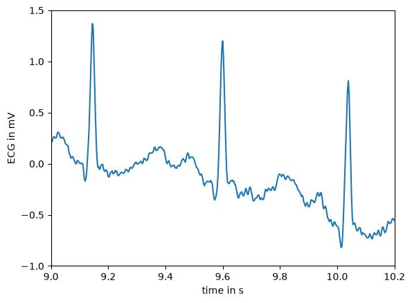
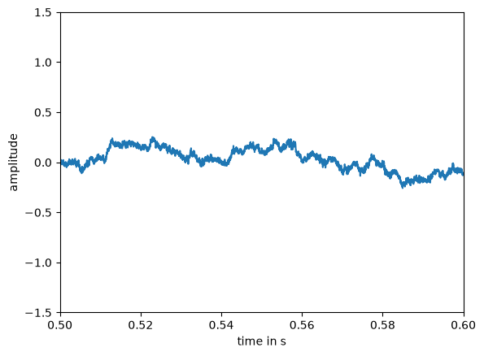
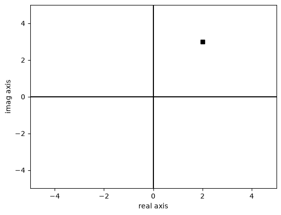
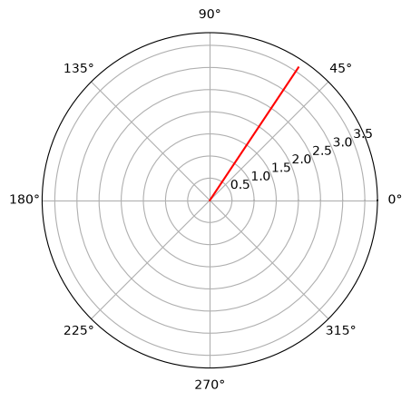

# Digital Signal Processing (DSP) - Session 4

---

## The Z-Transform and Its Application to the Analysis of LTI Systems

> ***Example 1.2***
> 
> Determine the z-transform of the signal
> 
> $$x(n) = (\frac{1}{2})^nu(n)$$
> 
> *Solution*
> 
> 1. **Apply the Z-Transform Definition**: The z-transform is defined by the power series: $$X(z) = \sum_{n=-\infty}^{\infty} x(n)z^{-n}$$
>     
> 2. **Substitute the Signal**: Since the unit step signal **$u(n)$** is $1$ for $n \ge 0$ and $0$ for $n < 0$, change the summation limits: $$X(z) = \sum_{n=0}^{\infty} \left(\frac{1}{2}\right)^n z^{-n}$$
>     
> 3. **Rewrite as a Single Power**: Combine the terms into a geometric series form: $$X(z) = \sum_{n=0}^{\infty} \left(\frac{1}{2} z^{-1}\right)^n$$
>     
> 4. **Use Geometric Series Summation**: Recall the sum formula for an infinite geometric series: $\sum_{n=0}^{\infty} A^n = \frac{1}{1-A}$ if $|A| < 1$. Here, $A = \frac{1}{2} z^{-1}$.
>     
> 5. **Determine the Closed-Form Expression**: Substitute $A$ into the formula: **$$X(z) = \frac{1}{1 - \frac{1}{2} z^{-1}}$$**
>     
> 6. **Find the Region of Convergence (ROC)**: The series converges only if $|\frac{1}{2} z^{-1}| < 1$. Solving for $z$: $\frac{1}{2} |z|^{-1} < 1 \implies \frac{1}{2|z|} < 1 \implies$ **$|z| > \frac{1}{2}$**.

> ***Example 1.3***
>
> Determine the **z-transform** of the exponential signal:
> 
> $$
> x(n) = \alpha^n u(n) =
> \begin{cases}
> \alpha^n, & n \ge 0 \\
> 0, & n < 0 
> \end{cases}
> $$
> 
> *Solution*
> 
> 1. **Use the Z-Transform Definition**: Apply the standard power series formula: $$X(z) = \sum_{n=-\infty}^{\infty} x(n)z^{-n}$$
> 2. **Substitute the Signal**: Since the unit step $u(n)$ is zero for $n < 0$, adjust the summation limits: $$X(z) = \sum_{n=0}^{\infty} \alpha^n z^{-n}$$
> 3. **Rewrite as a Geometric Series**: Combine the terms into a single power of $n$: $$X(z) = \sum_{n=0}^{\infty} (\alpha z^{-1})^n$$
> 4. **Apply Geometric Series Summation**: Use the sum formula $\sum_{n=0}^{\infty} A^n = \frac{1}{1-A}$, which is valid for $|A| < 1$.
> 5. **Form the Closed-Form Expression**: Substitute $A = \alpha z^{-1}$ into the sum formula: **$$X(z) = \frac{1}{1 - \alpha z^{-1}}$$**
> 6. **Determine the Region of Convergence (ROC)**: The series converges only if $|\alpha z^{-1}| < 1$. Solving for $z$ yields: **$|z| > |\alpha|$**

> ***Example 1.4***
>
> Determine the **z-transform** of the anticausal signal:
> $$
> x(n) = -\alpha^n u(-n-1) =
> \begin{cases} 0, & n \ge 0 \\
> -\alpha^n, & n \le -1 
> \end{cases}
> $$
> 
> *Solution*
> 
> 1. **Use the Z-Transform Definition**: Apply the standard power series formula: $X(z) = \sum_{n=-\infty}^{\infty} x(n)z^{-n}$.
> 2. **Substitute the Signal**: Adjust the limits for the anticausal signal: $$X(z) = \sum_{n=-\infty}^{-1} (-\alpha^n) z^{-n}$$
> 3. **Change Variable for Summation**: Let $l = -n$. The sum becomes: $$X(z) = -\sum_{l=1}^{\infty} (\alpha^{-1} z)^l$$
> 4. **Apply Geometric Series Summation**: Use the formula $A + A^2 + A^3 + \dots = \frac{A}{1-A}$ for $|A| < 1$.
> 5. **Form the Closed-Form Expression**: Substitute $A = \alpha^{-1} z$ into the formula and simplify: $$X(z) = -\frac{\alpha^{-1} z}{1 - \alpha^{-1} z} = {\frac{1}{1 - \alpha z^{-1}}}$$
> 6. **Determine the Region of Convergence (ROC)**: The series converges only if $|\alpha^{-1} z| < 1$. Solving for $z$ yields the interior of a circle: **$|z| < |\alpha|$**

**Note:** Examples 1.3 and 1.4 highlight that a closed-form expression does not uniquely specify a signal; both the expression and the **ROC** are required for uniqueness.

> ***Example 1.5***
>
> Determine the **z-transform** of the two-sided signal: $$x(n) = \alpha^n u(n) + b^n u(-n-1)$$
> 
> *Solution*
> 
> 1. **Use the Z-Transform Definition**: Apply the standard power series formula: $X(z) = \sum_{n=-\infty}^{\infty} x(n)z^{-n}$.
> 2. **Substitute the Signal Components**: Split the summation into two parts corresponding to the causal and anticausal terms: $$X(z) = \sum_{n=0}^{\infty} \alpha^n z^{-n} + \sum_{n=-\infty}^{-1} b^n z^{-n}$$
> 3. **Rewrite as Geometric Series**: $$X(z) = \sum_{n=0}^{\infty} (\alpha z^{-1})^n + \sum_{l=1}^{\infty} (b^{-1} z)^l$$
> 4. **Determine Convergence Conditions**:
>     - The first series converges if $|\alpha z^{-1}| < 1 \implies$ **$|z| > |\alpha|$**.
>     - The second series converges if $|b^{-1} z| < 1 \implies$ **$|z| < |b|$**.
> 5. **Analyze the Region of Convergence (ROC)**:
>     - If **$|b| < |\alpha|$**, there is no common region of convergence; thus, **$X(z)$ does not exist**.
>     - If **$|\alpha| < |b|$**, the common region is the ring between the two circles: **$|\alpha| < |z| < |b|$**.
> 6. **Form the Closed-Form Expression**: If the ROC exists ($|\alpha| < |b|$), combine the results of the two geometric series: $$X(z) = \frac{1}{1 - \alpha z^{-1}} - \frac{1}{1 - b z^{-1}}$$ Which simplifies to: **$$X(z) = \frac{(b - \alpha) z^{-1}}{(1 - \alpha z^{-1})(1 - b z^{-1})}$$**

### The Inverse z-Transform

- **Definition**: The procedure used to recover the time-domain signal $x(n)$ from its complex-plane representation $X(z)$.
- **Mathematical Basis**: Derived using the **Cauchy integral theorem**.
- **Inversion Formula**: $$x(n) = \frac{1}{2\pi j} \oint_C X(z)z^{n-1} dz$$ where $C$ is a counterclockwise closed contour within the **Region of Convergence (ROC)** that encloses the origin.
- **Practical Methods of Inversion**:
    1. **Contour Integration**: Direct evaluation of the integral by summing the residues of $X(z)z^{n-1}$ at the poles inside the contour $C$.
    2. **Power Series Expansion**: Expanding $X(z)$ into a series (often via **long division**); the coefficients of the resulting $z^{-n}$ terms represent the values of $x(n)$.
    3. **Partial-Fraction Expansion**: Decomposing a rational $z$-transform into simpler fractions that can be inverted using a **table lookup** and the linearity property.

### Properties of the z-Transform

- **Linearity**: The z-transform of a linear combination of signals equals the same linear combination of their individual transforms: $$a_1x_1(n) + a_2x_2(n) \leftrightarrow a_1X_1(z) + a_2X_2(z)$$
- **Time shifting**: Shifting a signal by $k$ samples corresponds to multiplication by $z^{-k}$: $$x(n - k) \leftrightarrow z^{-k}X(z)$$ The ROC remains unchanged except possibly at $z=0$ or $z=\infty$.
- **Scaling in the z-domain**: Multiplying a signal by an exponential sequence $a^n$ scales the complex variable $z$: $$a^nx(n) \leftrightarrow X(a^{-1}z)$$ The ROC is scaled by $|a|$.
- **Time reversal**: Reflecting a signal in the time domain corresponds to inverting the $z$ variable: $$x(-n) \leftrightarrow X(z^{-1})$$ The ROC is inverted ($1/r_2 < |z| < 1/r_1$).
- **Differentiation in the z-domain**: Multiplying a signal by $n$ corresponds to differentiation in the z-domain: $$nx(n) \leftrightarrow -z \frac{dX(z)}{dz}$$ The ROC remains the same.
- **Convolution of two sequences**: Convolution in the time domain is equivalent to multiplication in the z-domain: $$x_1(n) * x_2(n) \leftrightarrow X_1(z)X_2(z)$$ The ROC is at least the intersection of individual ROCs.
- **Correlation of two sequences**: The transform of the crosscorrelation of two signals is: $$r_{x_1x_2}(l) \leftrightarrow R_{x_1x_2}(z) = X_1(z)X_2(z^{-1})$$
- **Multiplication of two sequences**: Multiplication in the time domain corresponds to a complex convolution integral in the z-domain: $$x_1(n)x_2(n) \leftrightarrow \frac{1}{2\pi j} \oint_C X_1(v)X_2(z/v)v^{-1}dv$$
- **Parseval’s relation**: Relates the energy of signals in the time domain to an integral in the z-domain: $$\sum_{n=-\infty}^{\infty} x_1(n)x_2^*(n) = \frac{1}{2\pi j} \oint_C X_1(v)X_2^*(1/v^*)v^{-1}dv$$
- **The Initial Value Theorem**: For a causal signal ($x(n) = 0$ for $n < 0$), the initial value can be found by: $$x(0) = \lim_{z \to \infty} X(z)$$

> ***Example 2.1***
>
> Determine the **z-transform** and the **Region of Convergence (ROC)** of the signal: $$x(n) = [3(2^n) - 4(3^n)]u(n)$$
> 
> *Solution*
> 
> 1. **Define Signal Components**: Let
> 	- $x_1(n) = 2^n u(n)$
> 	- $x_2(n) = 3^n u(n)$
> 2. **Apply Linearity**: The signal is a linear combination: $$x(n) = 3x_1(n) - 4x_2(n)$$ The property states: $$X(z) = 3X_1(z) - 4X_2(z)$$
> 3. **Find Individual Transforms and ROCs**:
>     
>     Recall the pair: $$\alpha^n u(n) \leftrightarrow \frac{1}{1-\alpha z^{-1}}$$
>     
>     For $x_1(n)$ we get: $$x_1(n) = 2^n u(n) \leftrightarrow  X_1(z) = \frac{1}{1-2z^{-1}}$$ with **ROC: $|z| > 2$**.
>     
>     For $x_2(n)$ we get: $$x_2(n) = 3^n u(n) \leftrightarrow X_2(z) = \frac{1}{1-3z^{-1}}$$ with **ROC: $|z| > 3$**.
> 1. **Form the Combined Expression**: Substitute these into the linear equation: **$$X(z) = \frac{3}{1-2z^{-1}} - \frac{4}{1-3z^{-1}}$$**
> 2. **Determine Overall ROC**: The overall ROC is the **intersection** of the individual ROCs ($|z| > 2$ and $|z| > 3$). **ROC: $|z| > 3$**

> ***Proof of the time shifting property***
> 
> Let $y(n) = x(n - k)$ be the shifted signal. We determine its z-transform $Y(z)$ using the definition: $$Y(z) = \sum_{n=-\infty}^{\infty} y(n)z^{-n} = \sum_{n=-\infty}^{\infty} x(n - k)z^{-n}$$
> 
> To solve this, we make a **change of variable**. Let **$m = n - k$**, which implies that **$n = m + k$**. As $n$ ranges from $-\infty$ to $\infty$, $m$ also ranges from $-\infty$ to $\infty$. Substituting these into the summation: $$Y(z) = \sum_{m=-\infty}^{\infty} x(m)z^{-(m+k)}$$
> 
> Using the properties of exponents ($z^{-(m+k)} = z^{-m}z^{-k}$), we can rewrite the expression: $$Y(z) = \sum_{m=-\infty}^{\infty} x(m)z^{-m}z^{-k}$$
> 
> Since $z^{-k}$ does not depend on the summation index $m$, we can factor it out of the sum: $$Y(z) = z^{-k} \sum_{m=-\infty}^{\infty} x(m)z^{-m}$$
> 
> We recognize that the remaining summation is the definition of the z-transform $X(z)$. Therefore: **$$Y(z) = z^{-k}X(z)$$**

> ***Proof of the convolution of two sequences property***
>
> The convolution of $x_1(n)$ and $x_2(n)$ is defined as: $$x(n) = x_1(n) * x_2(n) = \sum_{k=-\infty}^{\infty} x_1(k)x_2(n-k)$$
> 
> By the definition of the direct z-transform, we have: $$X(z) = \sum_{n=-\infty}^{\infty} x(n)z^{-n} = \sum_{n=-\infty}^{\infty} \left[ \sum_{k=-\infty}^{\infty} x_1(k)x_2(n-k) \right] z^{-n}$$
> 
> Rearrange the terms to group those dependent on $n$: $$X(z) = \sum_{k=-\infty}^{\infty} x_1(k) \left[ \sum_{n=-\infty}^{\infty} x_2(n-k)z^{-n} \right]$$
> 
> The inner summation is the z-transform of the shifted sequence $x_2(n - k)$. According to the **time-shifting property**, $$x_2(n - k) \leftrightarrow z^{-k}X_2(z)$$
> 
> Substituting this into the equation: $$X(z) = \sum_{k=-\infty}^{\infty} x_1(k) \left[ z^{-k}X_2(z) \right]$$
> 
> Since $X_2(z)$ does not depend on the summation index $k$, it can be moved outside the sum: $$X(z) = X_2(z) \sum_{k=-\infty}^{\infty} x_1(k)z^{-k}$$ The remaining sum is the definition of $X_1(z)$. Thus: **$$X(z) = X_1(z)X_2(z)$$**

### Poles and Zeros

- **Definitions**:
    
    - **Zeros**: The values of $z$ for which $H(z) = 0$.
    - **Poles**: The values of $z$ for which $H(z) = \infty$.
- **Rational System Function (Standard Form)**: Assuming $a_0 = 1$ for a linear constant-coefficient difference equation: $$H(z) = \frac{Y(z)}{X(z)} = \frac{\sum_{k=0}^{M} b_k z^{-k}}{\sum_{k=0}^{N} a_k z^{-k}}$$
    
- **Factored (Pole-Zero) Form**: Factoring the polynomials reveals the specific locations of the zeros ($z_k$) and poles ($p_k$): $$H(z) = G z^{N-M} \frac{(z - z_1)(z - z_2) \dots (z - z_M)}{(z - p_1)(z - p_2) \dots (z - p_N)}$$
    
    - **Gain Factor ($G$)**: Defined as $b_0/a_0$.
    - **Trivial Singularities**: The term $z^{N-M}$ represents additional zeros (if $N > M$) or poles (if $N < M$) located at the **origin ($z = 0$)**.
- **Graphical Representation (Pole-Zero Plot)**:
    
    - **Poles** are indicated by crosses ($\times$).
    - **Zeros** are indicated by circles ($\circ$).
    - **Multiplicity**: If a pole or zero occurs more than once at the same location, the order is noted next to the mark.
- **Relationship to ROC**:
    
    - By definition, the **Region of Convergence (ROC)** of a z-transform cannot contain any poles.
    - The transform does not converge at a pole because the value becomes infinite.

> ***Example***
> 
> Determine $H(z)$ for this system:
> 
> $$y(n) = x(n) - \frac{1}{2}x(n-2) - y(n-1)$$
> 
> *Solution*
> 
> **1. Rearrange the Difference Equation**
> 
> First, group all the terms involving the output $y(n)$ on one side and the terms involving the input $x(n)$ on the other: $$y(n) + y(n-1) = x(n) - \frac{1}{2}x(n-2)$$
> 
> **2. Apply the Z-Transform**
> 
> Next, take the z-transform of both sides of the equation. According to the **time-shifting property**, a delay of $k$ samples in the time domain corresponds to multiplying by $z^{-k}$ in the z-domain ($x(n-k) \leftrightarrow z^{-k}X(z)$): $$Y(z) + z^{-1}Y(z) = X(z) - \frac{1}{2}z^{-2}X(z)$$
> 
> **3. Factor and Solve for $H(z)$**
> 
> Factor out $Y(z)$ and $X(z)$ from their respective sides: $$Y(z)(1 + z^{-1}) = X(z)\left(1 - \frac{1}{2}z^{-2}\right)$$
> 
> The system function **$H(z)$** is defined as the ratio of the output transform to the input transform: $$H(z) = \frac{Y(z)}{X(z)} = \frac{1 - \frac{1}{2}z^{-2}}{1 + z^{-1}}$$

> ***Example 3.1***
>
> Determine the pole-zero plot for the signal
> 
> $$
> x(n) = a^n u(n), \quad a > 0
> $$
> 
> *Solution*
> 
> 1.  **Compute the $z$-transform**:
>     Using the direct $z$-transform formula, 
>     $$X(z) = \sum_{n=0}^{\infty} a^n z^{-n} = \sum_{n=0}^{\infty} (az^{-1})^n$$
>     This geometric series converges when $|az^{-1}| < 1$, resulting in:
>     $$X(z) = \frac{1}{1 - az^{-1}}$$
> 2.  **Express as a rational function**:
>     Convert the expression to use positive powers of $z$ by multiplying the numerator and denominator by $z$:
>     $$X(z) = \frac{z}{z - a}$$
> 3.  **Identify zeros and poles**:
>     *   **Zeros**: The values of $z$ where the numerator is zero. Here, $X(z) = 0$ at **$z_1 = 0$**.
>     *   **Poles**: The values of $z$ where the denominator is zero (making $X(z)$ infinite). here, $X(z) = \infty$ at **$p_1 = a$**
> 4.  **Determine the Region of Convergence (ROC)**:
>     For a causal signal, the ROC is the exterior of a circle of radius equal to the magnitude of the largest pole. Thus, the **ROC is $|z| > a$**

> ***Example 3.2***
> 
> Determine the pole-zero plot for the signal:
> 
> $$
> x(n) =
> \begin{cases}
> a^n, & 0 \le n \le M-1 \\
> 0, & \text{elsewhere}
> \end{cases}
> $$
> 
> where $a > 0$.
> 
> *Solution*
> 
> 1. **Apply the Z-transform definition:** $$X(z) = \sum_{n=0}^{M-1} a^n z^{-n} = \sum_{n=0}^{M-1} (az^{-1})^n$$
> 2. **Use the finite geometric series formula:** $$X(z) = \frac{1 - (az^{-1})^M}{1 - az^{-1}}$$
> 3. **Rearrange into positive powers of $z$:** Multiply the numerator and denominator by $z^M$: $$X(z) = \frac{z^M - a^M}{z^{M-1}(z - a)}$$
> 4. **Find the zeros:** Zeros occur where the numerator is zero: $z^M - a^M = 0$. The $M$ roots are: **$z_k = a e^{j 2\pi k / M}$** for $k = 0, 1, \dots, M-1$.
> 5. **Find the poles:** The denominator indicates $M-1$ poles at **$z = 0$** (the origin) and one pole at **$z = a$**.
> 6. **Identify pole-zero cancellation:** For $k = 0$, the zero is $z_0 = a e^{j0} = a$. This **zero at $z = a$ cancels the pole at $z = a$**.
> 7. **Final Result:**
>     - **Zeros:** $M-1$ zeros located on a circle of radius $a$ at $z_k = a e^{j 2\pi k / M}$ for $k = 1, 2, \dots, M-1$.
>     - **Poles:** $M-1$ poles located at the origin ($z = 0$).

### Analysis of Linear Time-Invariant Systems in the z-Domain

- **Response of Systems with Rational System Functions**
    
    - Linear time-invariant (LTI) systems described by constant-coefficient difference equations have **rational system functions** of the form $$H(z) = \frac{B(z)}{A(z)}$$
    - For a relaxed system, the output $z$-transform is the product of the system function and the input $z$-transform: $$Y(z) = H(z)X(z)$$
    - The total response $y(n)$ can be subdivided into two parts:
        - **Natural Response**: Determined by the poles ${p_k}$ of the system.
        - **Forced Response**: Determined by the poles ${q_k}$ of the input signal.
    - The system's influence on the forced response and the input signal's influence on the natural response are exerted through scale factors (residues) determined during partial-fraction expansion.
- **Transient and Steady-State Responses**
    
    - **Transient Response**: In a stable system, all poles lie inside the unit circle ($|p_k| < 1$), causing the natural response to decay to zero as $n \to \infty$.
    - **Steady-State Response**: If the input signal is a sinusoid (poles on the unit circle), the forced response persists for all $n \ge 0$.
    - A system only sustains a steady-state output if the input signal itself persists (e.g., a sinusoid applied at $n=0$ that does not decay).
- **Causality and Stability**
    
    - **Causality**: An LTI system is causal if and only if the region of convergence (ROC) of its system function is the **exterior of a circle**, including $z = \infty$.
    - **Stability**: An LTI system is BIBO stable if and only if the **unit circle ($|z| = 1$) is contained within the ROC** of the system function $H(z)$.
    - **Combined Requirement**: A causal LTI system is BIBO stable if and only if **all poles of $H(z)$ lie strictly inside the unit circle**.
- **Pole-Zero Cancellations**
    
    - Occurs when a pole and zero are at the identical location, causing the term associated with that pole to vanish from the inverse $z$-transform.
    - This can be used to **reduce the order of a system** or to suppress specific modes of an input signal.
    - In practice, one should not attempt to stabilize an unstable system by placing a zero over an unstable pole because any numerical imprecision will prevent exact cancellation, likely leaving the system unstable.
- **Multiple-Order Poles and Stability**
    
    - If a system pole lies on the unit circle, the system is generally **unstable** because a matching pole in a bounded input (like a unit step) will create a multiple-order pole on the unit circle, resulting in an unbounded output (e.g., a ramp signal).
    - Stable systems must have poles strictly inside the unit circle; matching input poles will still result in terms like $n^{b} p_k^n$ in the output, but these will decay as $n \to \infty$ because the exponential factor $p_k^n$ dominates the polynomial $n^b$ when $|p_k| < 1$.
    - Systems with distinct poles on the unit circle (like digital oscillators) are often called **marginally stable**.
- **Stability of Second-Order Systems**
    
    - A causal two-pole system with $$H(z) = \frac{b_0}{1 + a_1 z^{-1} + a_2 z^{-2}}$$ is stable if its poles lie inside the unit circle.
    - This condition is satisfied if the coefficients $(a_1, a_2)$ fall within the **stability triangle** defined by:
        - $|a_2| < 1$
        - $|a_1| < 1 + a_2$
    - The unit sample response $h(n)$ behavior changes based on where the coefficients lie in this triangle: real and distinct poles, real and equal poles, or complex-conjugate poles.

---

## Digital Signal Processing in Python

### ECG Signal Analysis

#### Loading the ECG Data

```python
from scipy.datasets import electrocardiogram
ecg = electrocardiogram()
```

Loads a real-world ECG (electrocardiogram) sample dataset from SciPy. It's a 1D NumPy array of heart voltage readings.

#### Inspecting the Data

```python
# confirms it's a NumPy array
type(ecg)
# shape, mean, and standard deviation
ecg.shape, ecg.mean(), ecg.std()
# total number of samples
ecg.size
```

#### Plotting ECG Segments

```python
import numpy as np
import matplotlib.pyplot as plt

fs = 360
time = np.arange(ecg.size) / fs
plt.plot(time, ecg)
plt.xlabel("time in s")
plt.ylabel("ECG in mV")
plt.xlim(9, 10.2)
plt.ylim(-1, 1.5)
plt.show()
```



The signal was recorded at **fs = 360 Hz**, so `time = np.arange(ecg.size) / fs` converts sample indices to seconds.

### Audio Recording & Playback

#### Recording Audio
```python
import sounddevice
from scipy.io.wavfile import write
fs= 44100
second = int(input("enter time duration in second:"))
print("recording...")
record_voice= sounddevice.rec(int(second * fs), samplerate=fs, channels=1)
sounddevice.wait()
write("output.wav", fs, record_voice)
print("recording complete")
```
Records audio from the microphone for a user-specified duration at 44100 Hz and saves it as `output.wav`.

#### Listing Audio Devices
```python
sounddevice.query_devices()
```
Lists all available audio input/output devices on the system.

### Playback
Two ways to play back the saved file:

1. **`sounddevice` + `soundfile`** — reads the WAV and plays it via the system audio device

```python
import sounddevice
import soundfile as sf

data, fs = sf.read("output.wav", dtype="float32")
sounddevice.play(data, fs)
sounddevice.wait()
```

2. **`IPython.display.Audio`** — embeds an interactive audio player directly in the notebook

```python
from IPython.display import Audio
Audio("output.wav")
```

#### Visualizing the Audio Waveform

```python
fs = 44100
time = np.arange(data.size) / fs
plt.plot(time, data)
plt.xlabel("time in s")
plt.ylabel("amplitude")
plt.xlim(0.5, 0.6)
plt.ylim(-1.5, 1.5)
plt.show()
```



Plots the amplitude of the audio signal over time, zoomed into a 100ms window (0.5–0.6s).

### Complex Numbers

#### Complex Square Root

```python
cmath.sqrt(-1)  # 1j
```

#### Defining & Inspecting a Complex Number

```python
z = 2 + 3j
np.real(z)   # 2.0
np.imag(z)   # 3.0
np.abs(z)    # magnitude: 3.6055512754639896
np.angle(z)  # phase angle (rad): 0.982793723247329
```

#### Visualizations

- **Cartesian plot** — plots `z` as a point on the real/imaginary plane with axes drawn

```python
# plot the complex number
plt.plot(np.real(z),np.imag(z), 'ks')

# make plot look nicer
plt.xlim([-5,5])
plt.ylim([-5,5])
plt.plot([-5,5], [0,0],'k')
plt.plot([0,0], [-5,5],'k')
plt.xlabel('real axis')
plt.ylabel('imag axis')
plt.show()
```



- **Polar plot** — uses `plt.polar()` to draw a vector from the origin with its magnitude and angle

```python
mag = np.abs(z)
ang = np.angle(z)

plt.polar([0, ang], [0, mag], 'r')
plt.show()
```



#### Polynomial Roots

```python
p = [1, 0, 0, 1]
np.roots(p)
```

```
array([-1. +0.j       ,  0.5+0.8660254j,  0.5-0.8660254j])
```

Finds solutions to $x^3 + 1 = 0$.
