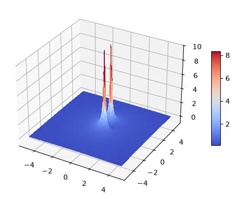

# Digital Signal Processing (DSP) - Session 5

---

## Plot the Graph of $|X(z)|$ for the z-transform with Python and matplotlib

$|X(z)|$, the magnitude of $X(z)$, is a real and
positive function of $z$. Since $z$ represents a point in the complex plane, $|X(z)|$ is a
two-dimensional function and describes a “surface.”

For example, plot the graph of $|X(z)|$ for the z-transform

$$
X(z) = \frac{z^{-1} - z^{-2}}{1 - 1.2732z^{-1} + 0.81z^{-2}}
= \frac{z - 1}{z^2 - 1.2732z + 0.81}
$$

which has one zero at $z_1 = 1$ and two poles at $p_1 = 0.9e^{j π/4}, p_2 = 0.9e^{-j π/4}$.

Reference: https://matplotlib.org/stable/gallery/mplot3d/subplot3d.html

```python
import matplotlib.pyplot as plt
import numpy as np
from matplotlib import cm

# set up a figure twice as wide as it is tall
fig = plt.figure(figsize=plt.figaspect(0.5))

# set up the Axes
ax = fig.add_subplot(1, 1, 1, projection='3d')

# plot a 3D surface like in the example mplot3d/surface3d_demo
X = np.arange(-5, 5, 0.1)
Y = np.arange(-5, 5, 0.1)
X, Y = np.meshgrid(X, Y)
H = X+Y*1j
Z = np.abs((H**-1-H**-2)/(1-1.2732*H**-1+0.81*H**-2))
surf = ax.plot_surface(X, Y, Z, rstride=1, cstride=1, cmap=cm.coolwarm,
linewidth=0, antialiased=False)
ax.set_zlim(-1, 10)
fig.colorbar(surf, shrink=0.5, aspect=10)
```



Note the high peaks near the singularities (poles) and the deep valley close to the zero.

---

## Frequency Analysis of Signals

**Frequency Analysis** involves decomposing a signal into its frequency (sinusoidal) components to provide a mathematical and pictorial representation of its frequency content, often called its **spectrum**. This spectrum acts as a "signature" for the signal, as different signal waveforms have different spectra.

**The Prism Analogy**: As a glass prism causes a beam of sunlight to refract into a spectrum of colors, frequency analysis tools (like the Fourier series or transform) analyze time-domain waveforms into their component frequencies. Recombining these components to reconstruct the original signal is a process known as **Fourier synthesis**.

**Importance for LTI Systems**: Decomposing signals into sinusoids (or complex exponentials) is essential because when a sinusoid is passed through a **Linear Time-Invariant (LTI) system**, the output is a sinusoid of the same frequency, differing only in amplitude and phase.

We consider four cases based on whether the time variable is **continuous or discrete** and whether the signal is **periodic or aperiodic**:

1. Continuous-Time Periodic Signals
2. Continuous-Time Aperiodic Signals
3. Discrete-Time Periodic Signals
4. Discrete-Time Aperiodic Signals

### The Fourier Series for Continuous-Time Periodic Signals

The Fourier series is a mathematical representation used to decompose a continuous-time periodic signal into a linear weighted sum of harmonically related complex exponentials or sinusoids.

**Synthesis Equation**

$$x(t) = \sum_{k=-\infty}^{\infty} c_k e^{j2\pi k F_0 t}$$

This equation, called the **Fourier Series**, shows how a periodic signal $x(t)$ is constructed (synthesized) from its basic "building blocks". These blocks are exponential signals ${e^{j2\pi k F_0 t}}$ where $k$ ranges from $-\infty$ to $\infty$. $F_0$ represents the **fundamental frequency**, which is the reciprocal of the fundamental period $T_p$ ($F_0 = 1/T_p$). The coefficients $c_k$ act as weighting factors that specify the shape of the resulting waveform.

**Analysis Equation**

$$c_k = \frac{1}{T_p} \int_{T_p} x(t) e^{-j2\pi k F_0 t} dt$$

This equation is used to determine the **Fourier coefficients** $c_k$ from a given periodic signal $x(t)$. The integration is performed over any single period of length $T_p$. Physically, each $c_k$ represents the amplitude and phase associated with the $k$-th harmonic component of the signal.

**Key Spectral Representations**

The information contained in the complex-valued Fourier coefficients ${c_k}$ can be visualized through different types of spectra:

- **Amplitude (Magnitude) Spectrum:** This is a plot of the magnitude of the coefficients, ${|c_k|}$, against the frequency $kF_0$. It represents the "strength" of each harmonic component. For real-valued signals, this spectrum is always a **symmetric (even) function**.
- **Phase Spectrum:** This is a plot of the phase angles, ${\theta_k = \angle c_k}$, against frequency. It represents the relative time-shift of each harmonic. For real-valued signals, the phase spectrum is an **antisymmetric (odd) function**.
- **Power Density Spectrum:** This diagram plots ${|c_k|^2}$ as a function of frequency, showing how the total average power of the periodic signal is distributed among its various frequency components. Because power only exists at discrete values (multiples of $F_0$), it is often called a **line spectrum**.

**Key Properties**

- **Line Spectrum Characteristic:** Periodic signals possess discrete spectra where the spectral lines are equally spaced by the fundamental frequency $F_0$.
- **Symmetry for Real Signals:** If the signal $x(t)$ is real, then $c_{-k} = c_k^*$ (complex conjugates). This implies that the magnitude spectrum is even ($|c_k| = |c_{-k}|$) and the phase spectrum is odd ($\theta_k = -\theta_{-k}$).
- **Parseval’s Relation for Power Signals:** The total average power $P_x$ of a periodic signal can be calculated by summing the power of all its individual harmonic components: $$P_x = \frac{1}{T_p} \int_{T_p} |x(t)|^2 dt = \sum_{k=-\infty}^{\infty} |c_k|^2$$ This establishes the principle of **conservation of energy** between the time and frequency domains.

**Convergence and Dirichlet Conditions**

For the Fourier series to exactly equal $x(t)$ at every value of $t$, the signal must satisfy the **Dirichlet conditions**:

1. The signal $x(t)$ must have a finite number of discontinuities within any period.
2. The signal $x(t)$ must contain a finite number of maxima and minima during any period.
3. The signal $x(t)$ must be absolutely integrable over a period. All periodic signals of practical interest generally satisfy these conditions.

> ***Example 1.1***
> 
> **Determine the Fourier series and the power density spectrum** of the rectangular pulse train signal $x(t)$ with amplitude $A$ and pulse width $\tau$, periodic with fundamental period $T_p$, as illustrated in Fig 1.3.
> 
> *Solution*
> 
> 1. **Identify Signal Properties:** The signal $x(t)$ is periodic with fundamental period $T_p$ and fundamental frequency $F_0 = 1/T_p$. It is an **even signal** $x(t) = x(-t)$, so it is convenient to integrate over the interval $[-T_p/2, T_p/2]$.
> 
> 2. **Apply the Fourier Analysis Equation:** The Fourier coefficients $c_k$ are determined using the analysis equation: $$c_k = \frac{1}{T_p} \int_{-T_p/2}^{T_p/2} x(t)e^{-j2\pi kF_0t} dt$$
> 
> 3. **Determine $c_0$ (DC Component):** For $k=0$, the coefficient represents the average value of the signal over one period: $$c_0 = \frac{1}{T_p} \int_{-T_p/2}^{T_p/2} x(t) dt = \frac{1}{T_p} \int_{-\tau/2}^{\tau/2} A dt = \frac{A\tau}{T_p}$$
> 
> 4. **Determine $c_k$ for $k \neq 0$:** Substitute the signal definition into the analysis equation: $$c_k = \frac{1}{T_p} \int_{-\tau/2}^{\tau/2} Ae^{-j2\pi kF_0t} dt$$ $$c_k = \frac{A}{T_p} \left[ \frac{e^{-j2\pi kF_0t}}{-j2\pi kF_0} \right]_{-\tau/2}^{\tau/2}$$ $$c_k = \frac{A}{-j2\pi kF_0T_p} (e^{-j\pi kF_0\tau} - e^{j\pi kF_0\tau})$$
> 
> 5. **Simplify Using Euler's Identity:** Rearrange the terms to form the sine function, noting that $F_0T_p = 1$: $$c_k = \frac{A}{\pi k} \left( \frac{e^{j\pi kF_0\tau} - e^{-j\pi kF_0\tau}}{j2} \right)$$ $$c_k = \frac{A\tau}{T_p} \frac{\sin(\pi kF_0\tau)}{\pi kF_0\tau}, \quad k = \pm 1, \pm 2, \dots$$ The coefficients are real-valued, following a $(\sin \phi)/\phi$ envelope with zero crossings at $kF_0 = m/\tau$.
> 
> 6. **Determine the Power Density Spectrum** The power density spectrum $|c_k|^2$ represents the power distribution across discrete frequencies $kF_0$: $$|c_k|^2 = \begin{cases} \left( \frac{A\tau}{T_p} \right)^2, & k = 0 \\ \left( \frac{A\tau}{T_p} \right)^2 \left( \frac{\sin(\pi kF_0\tau)}{\pi kF_0\tau} \right)^2, & k = \pm 1, \pm 2, \dots \end{cases}$$

### The Fourier Transform for Continuous-Time Aperiodic Signals

The Fourier transform is a mathematical tool used to represent aperiodic (non-periodic), finite-energy signals in the frequency domain. Unlike periodic signals, which have discrete "line" spectra, aperiodic signals possess a **continuous spectrum**.

**Synthesis Equation (Inverse Transform)**

$$x(t) = \int_{-\infty}^{\infty} X(F) e^{j2\pi Ft} dF$$

This equation describes the **synthesis** problem: how an aperiodic signal $x(t)$ is reconstructed from its frequency components. Because the signal is not periodic, its frequency content is not limited to discrete harmonics; instead, it is composed of a **continuum of infinitesimal complex exponentials** ${e^{j2\pi Ft}}$. Consequently, the reconstruction is performed through **integration** over all frequencies from $-\infty$ to $\infty$ rather than a summation.

**Analysis Equation (Direct Transform)**

$$X(F) = \int_{-\infty}^{\infty} x(t) e^{-j2\pi Ft} dt$$

This equation, called the **Fourier Transform**, is used for **spectral analysis**. It determines the function $X(F)$, which represents the **frequency content** of the signal $x(t)$. Physically, $X(F)$ acts as a "signature" for the signal, providing a mathematical and pictorial representation of its frequency components.

**Key Spectral Representations**

The complex-valued function $X(F)$ is typically expressed in polar form to visualize the signal's characteristics:

- **Amplitude (Magnitude) Spectrum:** Denoted as **$|X(F)|$**, this represents the distribution of the magnitudes of the frequency components. For real-valued signals, this spectrum exhibits **even symmetry** ($|X(F)| = |X(-F)|$).
- **Phase Spectrum:** Denoted as **$\theta(F)$** or **$\angle X(F)$**, this represents the phase shift associated with each frequency. For real signals, the phase spectrum has **odd symmetry** ($\angle X(-F) = -\angle X(F)$).
- **Energy Density Spectrum:** Defined as **$S_{xx}(F) = |X(F)|^2$**, this function describes how the total energy of a signal is distributed across different frequencies. It contains no phase information and is always purely real and non-negative.

**Key Properties**

- **Continuous Spectrum:** Because aperiodic signals have an infinite period ($T_p \to \infty$), the spacing between spectral lines in a periodic representation tends toward zero, resulting in a continuous frequency range.
- **Uncertainty Principle:** There is an inverse relationship between a signal's duration in time and its bandwidth in frequency; for example, if a signal is compressed (shortened) in time, its Fourier transform is expanded (widened) in frequency.
- **Parseval’s Relation for Energy Signals:** The total energy $E_x$ of the signal can be calculated in either the time or frequency domain: $$E_x = \int_{-\infty}^{\infty} |x(t)|^2 dt = \int_{-\infty}^{\infty} |X(F)|^2 dF$$ This establishes the **principle of conservation of energy** across both domains.

**Convergence and Dirichlet Conditions**

For the Fourier transform to exist, the signal $x(t)$ generally must satisfy the **Dirichlet conditions**:

1. The signal must have a **finite number of finite discontinuities**.
2. The signal must have a **finite number of maxima and minima**.
3. The signal must be **absolutely integrable**, meaning $\int_{-\infty}^{\infty} |x(t)| dt < \infty$. A weaker condition is that the signal has **finite energy**; nearly all finite-energy signals encountered in practice have a valid Fourier transform.

> ***Example 1.2***
> 
> **Determine the Fourier transform and the energy density spectrum** of a rectangular pulse signal defined as:
> 
> $$
> x(t) =
> \begin{cases}
> A, & |t| \leq \tau/2 \\
> 0, & |t| > \tau/2
> \end{cases}
> $$
> 
> *Solution*
>
> 1. **Check Existence Conditions:** The signal is **aperiodic** and satisfies **Dirichlet conditions**, meaning its Fourier transform exists.
> 
> 2. **Apply the Fourier Transform Formula:** Using the analysis equation for continuous-time aperiodic signals: $$X(F) = \int_{-\infty}^{\infty} x(t)e^{-j2\pi Ft} dt$$
> 
> 3. **Evaluate the Integral:** Since the signal is zero outside $|t| > \tau/2$, integrate over the pulse width: $$X(F) = \int_{-\tau/2}^{\tau/2} Ae^{-j2\pi Ft} dt$$ $$X(F) = A \left[ \frac{e^{-j2\pi Ft}}{-j2\pi F} \right]_{-\tau/2}^{\tau/2}$$ $$X(F) = \frac{A}{-j2\pi F} (e^{-j\pi F\tau} - e^{j\pi F\tau})$$
> 
> 4. **Simplify Using Euler's Identity:** Rearrange the terms to form the sine function: $$X(F) = \frac{A}{\pi F} \left( \frac{e^{j\pi F\tau} - e^{-j\pi F\tau}}{j2} \right)$$ $$X(F) = A\tau \frac{\sin(\pi F\tau)}{\pi F\tau}$$ This result is real-valued and follows the $(\sin \phi)/\phi$ shape, with zero crossings at multiples of $1/\tau$.
> 
> 5. **Determine the Energy Density Spectrum:** The energy density spectrum $S_{xx}(F)$ represents the distribution of energy across frequencies and is defined as the magnitude squared of the Fourier transform: $$S_{xx}(F) = |X(F)|^2$$ Substituting the derived $X(F)$: $$S_{xx}(F) = (A\tau)^2 \left( \frac{\sin(\pi F\tau)}{\pi F\tau} \right)^2$$

### The Fourier Series for Discrete-Time Periodic Signals

The **Discrete-Time Fourier Series (DTFS)** is the mathematical tool used to represent a discrete-time periodic signal as a linear weighted sum of harmonically related complex exponentials.

**Synthesis Equation**

$$x(n) = \sum_{k=0}^{N-1} c_k e^{j2\pi kn/N}$$

This equation, called the **Fourier Series** describes the **synthesis** (reconstruction) of the periodic sequence $x(n)$ from its frequency components. A fundamental difference from the continuous-time Fourier series is that the discrete-time version contains at most **$N$ distinct frequency components**, where $N$ is the fundamental period. This is because discrete-time complex exponentials ${e^{j2\pi kn/N}}$ separated by $N$ in frequency are identical ($s_{k+N}(n) = s_k(n)$). Consequently, the reconstruction is a **finite sum** over a single period of the frequency index $k$.

**Analysis Equation**

$$c_k = \frac{1}{N} \sum_{n=0}^{N-1} x(n) e^{-j2\pi kn/N}$$

This equation is used for **spectral analysis** to determine the **Fourier coefficients** ${c_k}$. These coefficients provide a description of the signal $x(n)$ in the frequency domain, where each $c_k$ represents the amplitude and phase associated with the $k$-th harmonic component. The index $k$ corresponds to the frequency $\omega_k = 2\pi k/N$.

**Key Spectral Representations**

The complex-valued coefficients ${c_k}$ are typically visualized using the following plots:

- **Amplitude (Magnitude) Spectrum:** A plot of the magnitude **$|c_k|$** against the frequency index $k$. It indicates the relative strength of each harmonically related component. For real-valued signals, this spectrum exhibits **even symmetry** ($|c_k| = |c_{N-k}|$).
- **Phase Spectrum:** A plot of the phase angles **$\angle c_k$** against frequency. It represents the relative phase shift of each harmonic. For real signals, it exhibits **odd symmetry** ($\angle c_k = -\angle c_{N-k}$).
- **Power Density Spectrum:** A plot of the squared magnitudes **$|c_k|^2$** against frequency. It describes how the average power of the periodic signal is distributed among its $N$ frequency components.

**Key Properties**

- **Periodic Spectrum:** In discrete-time, the spectrum ${c_k}$ is itself a **periodic sequence** with the same fundamental period $N$ as the signal ($c_{k+N} = c_k$). This reflects the finite unique frequency range $(-\pi, \pi)$ of discrete-time signals.
- **Symmetry for Real Signals:** If $x(n)$ is real, then $c_k = c_{-k}^{*}$ (or $c_k = c_{N-k}^{*}$ due to periodicity). This means the signal's frequency content is completely specified by only half a period of the spectrum ($k = 0$ to $N/2$).
- **Parseval’s Relation for Power Signals:** The total average power $P_x$ of the periodic signal can be calculated in either the time or frequency domain: $$P_x = \frac{1}{N} \sum_{n=0}^{N-1} |x(n)|^2 = \sum_{k=0}^{N-1} |c_k|^2$$ This establishes that the average power in the signal is equal to the **sum of the powers** of its individual frequency components.

> ***Example 2.2 Periodic "Square-Wave" Signal***
> 
> **Determine the Fourier series coefficients and the power density spectrum** of the periodic discrete-time square-wave signal $x(n)$ with period $N$, defined over one fundamental period as: $$x(n) = \begin{cases} A, & 0 \leq n \leq L-1 \\ 0, & L \leq n \leq N-1 \end{cases}$$
> 
> *Solution*
> 
> 1. **Apply the Fourier Analysis Equation** The coefficients $c_k$ are determined using: $$c_k = \frac{1}{N} \sum_{n=0}^{N-1} x(n)e^{-j2\pi kn/N}, \quad k = 0, 1, \dots, N-1$$
> 
> 2. **Substitute the Signal Values** Since the signal is zero for $n \geq L$, the summation limits are reduced: $$c_k = \frac{1}{N} \sum_{n=0}^{L-1} Ae^{-j2\pi kn/N}, \quad k = 0, 1, \dots, N-1$$
> 
> 3. **Evaluate the Geometric Summation** For $k=0$: $$c_0 = \frac{AL}{N}$$ For $k = 1, 2, \dots, N-1$: $$c_k = \frac{A}{N} \sum_{n=0}^{L-1} (e^{-j2\pi k/N})^n = \frac{A}{N} \frac{1- e^{-j2\pi kL/N}}{1- e^{-j2\pi k/N}}$$
> 
> 4. **Simplify Using Trigonometric Identities** Rearrange the expression to form sine functions: $$\frac{1- e^{-j2\pi kL/N}}{1- e^{-j2\pi k/N}} = \frac{e^{-j\pi kL/N}}{e^{-j\pi k/N}} \frac{e^{j\pi kL/N} - e^{-j\pi kL/N}}{e^{j\pi k/N} - e^{-j\pi k/N}}$$ $$= e^{-j\pi k(L-1)/N} \frac{\sin(\pi kL/N)}{\sin(\pi k/N)}$$
> 
> 5. **Final Fourier Series Coefficients** Combining the results: $$c_k = \begin{cases} \frac{AL}{N}, & k = 0, \pm N, \pm 2N, \dots \\ \frac{A}{N} e^{-j\pi k(L-1)/N} \frac{\sin(\pi kL/N)}{\sin(\pi k/N)}, & \text{otherwise} \end{cases}$$
> 
> 6. **Determine the Power Density Spectrum** The power density spectrum $|c_k|^2$ is the magnitude squared of the coefficients: $$|c_k|^2 = \begin{cases} \left( \frac{AL}{N} \right)^2, & k = 0, \pm N, \pm 2N, \dots \\ \left( \frac{A}{N} \right)^2 \left( \frac{\sin \pi kL/N}{\sin \pi k/N} \right)^2, & \text{otherwise} \end{cases}$$

### The Fourier Transform for Discrete-Time Aperiodic Signals

The **Discrete-Time Fourier Transform (DTFT)** is the mathematical tool used to represent aperiodic, finite-energy sequences in the frequency domain. Physically, $X(\omega)$ represents the **frequency content** of the signal $x(n)$, providing a decomposition of the sequence into its constituent frequency components.

**Synthesis Equation (Inverse Transform)**

$$x(n) = \frac{1}{2\pi} \int_{2\pi} X(\omega) e^{j\omega n} d\omega$$

This equation describes the **synthesis** (reconstruction) of the sequence $x(n)$ from its continuous frequency representation $X(\omega)$. Because the discrete-time signal is represented by a **continuum of frequency components**, the reconstruction is performed through **integration** over a single $2\pi$ period (typically $-\pi$ to $\pi$) rather than a summation. The factor $1/2\pi$ serves as a normalization constant.

**Analysis Equation (Direct Transform)**

$$X(\omega) = \sum_{n=-\infty}^{\infty} x(n) e^{-j\omega n}$$

This equation, called the **Fourier Transform**, is used for **spectral analysis** to determine the function $X(\omega)$ from a given sequence $x(n)$. Unlike the continuous-time Fourier transform, this analysis involves a **summation** of terms because the signal is discrete in time. $X(\omega)$ acts as a frequency-domain "signature" for the discrete sequence.

**Key Spectral Representations**

The complex-valued function $X(\omega)$ is typically expressed in polar form to visualize the characteristics of the signal:

- **Amplitude (Magnitude) Spectrum:** Denoted as **$|X(\omega)|$**, this shows the magnitude of each frequency component. For real-valued signals, the magnitude spectrum exhibits **even symmetry** ($|X(-\omega)| = |X(\omega)|$).
- **Phase Spectrum:** Denoted as **$\theta(\omega)$** or **$\angle X(\omega)$**, this represents the phase shift associated with each frequency. For real signals, the phase spectrum exhibits **odd symmetry** ($\theta(-\omega) = -\theta(\omega)$).
- **Energy Density Spectrum:** Defined as **$S_{xx}(\omega) = |X(\omega)|^2$**, this function describes how the total energy of the aperiodic signal is distributed across frequencies. It contains no phase information and is always purely real and non-negative.

**Key Properties**

- **Periodic Spectrum:** A fundamental property of discrete-time signals is that their spectra are always **periodic with period $2\pi$**. Consequently, the frequency range is finite and unique over any interval of length $2\pi$, such as $(-\pi, \pi)$.
- **Symmetry for Real Signals:** If $x(n)$ is real, the spectrum possesses **Hermitian symmetry** ($X^*(\omega) = X(-\omega)$), meaning the magnitude is even and the phase is odd. Because of this, the signal is completely specified by its spectrum in the range $0 \leq \omega \leq \pi$.
- **Parseval’s Relation for Energy Signals:** The total energy $E_x$ of a discrete-time signal can be calculated in either the time or frequency domain: $$E_x = \sum_{n=-\infty}^{\infty} |x(n)|^2 = \frac{1}{2\pi} \int_{-\pi}^{\pi} |X(\omega)|^2 d\omega$$ This establishes the **principle of conservation of energy** across both domains.

**Convergence of the Transform**

For the DTFT to exist and converge, the sequence must satisfy certain conditions:

- **Uniform Convergence:** This is guaranteed if the sequence $x(n)$ is **absolutely summable**, meaning $\sum_{n=-\infty}^{\infty} |x(n)| < \infty$.
- **Mean-Square Convergence:** For sequences that are not absolutely summable but have **finite energy** (square-summable), the transform converges in the mean-square sense. In such cases, oscillatory behavior known as the **Gibbs phenomenon** may occur at points of discontinuity in $X(\omega)$.

> *** Example 2.4***
> 
> **Determine the Fourier transform and the energy density spectrum** of the sequence: $$x(n) = \begin{cases} A, & 0 \leq n \le L-1 \\ 0, & \text{otherwise} \end{cases}$$
> 
> *Solution*
> 
> 1. **Check Convergence Conditions:** The sequence is **absolutely summable**, confirming the Fourier transform exists: $$\sum_{n=-\infty}^{\infty} |x(n)| = \sum_{n=0}^{L-1} |A| = L|A| < \infty$$ The signal has **finite energy** $E_x = |A|^2L$.
> 
> 2. **Apply the Fourier Transform Formula:** Using the analysis equation for discrete-time aperiodic signals: $$X(\omega) = \sum_{n=-\infty}^{\infty} x(n)e^{-j\omega n}$$ Substituting the signal definition: $$X(\omega) = \sum_{n=0}^{L-1} Ae^{-j\omega n}$$
> 
> 3. **Evaluate the Geometric Summation:** Apply the finite geometric series formula: $$X(\omega) = A \frac{1- e^{-j\omega L}}{1- e^{-j\omega}}$$
> 
> 4. **Simplify Using Trigonometric Identities:** Factor out the half-angle exponentials from the numerator and denominator: $$X(\omega) = A \frac{e^{-j\omega L/2} (e^{j\omega L/2} - e^{-j\omega L/2})}{e^{-j\omega/2} (e^{j\omega/2} - e^{-j\omega/2})}$$ $$X(\omega) = Ae^{-j(\omega/2)(L-1)} \frac{\sin(\omega L/2)}{\sin(\omega/2)}$$
> 
> 5. **Determine the Magnitude and Phase Spectra:** The **magnitude spectrum** is: $$|X(\omega)| = \begin{cases} |A|L, & \omega = 0 \\ |A| \left| \frac{\sin(\omega L/2)}{\sin(\omega/2)} \right|, & \text{otherwise} \end{cases}$$ The **phase spectrum** is: $$\angle X(\omega) = \angle A - \frac{\omega}{2}(L-1) + \angle \left( \frac{\sin(\omega L/2)}{\sin(\omega/2)} \right)$$
> 
> 6. **Determine the Energy Density Spectrum** The energy density spectrum $S_{xx}(\omega)$ is the magnitude squared of the Fourier transform: $$S_{xx}(\omega) = |X(\omega)|^2$$ Substituting the derived magnitude: $$S_{xx}(\omega) = |A|^2 \left( \frac{\sin(\omega L/2)}{\sin(\omega/2)} \right)^2$$

### Relationship of the Fourier Transform to the z-Transform

The Fourier transform is mathematically equivalent to the **z-transform evaluated on the unit circle**.

$$X(z)|_{z=e^{j\omega}} = X(\omega)$$

To see this relationship, we represent the complex variable $z$ in polar form as $z = re^{j\omega}$, where $r$ is the magnitude and $\omega$ is the angle. When we substitute this into the z-transform equation, we get: $$X(z)|_{z=re^{j\omega}} = \sum_{n=-\infty}^{\infty} [x(n)r^{-n}]e^{-j\omega n}$$ This expression is the Fourier transform of the signal $x(n)$ weighted by an exponential factor $r^{-n}$. When the magnitude **$r = 1$**, the variable $z$ lies exactly on the unit circle ($z = e^{j\omega}$), and the equation reduces to the standard **Discrete-Time Fourier Transform (DTFT)**.

**Key Conditions and Interpretations**

- **Region of Convergence (ROC) Requirement:** The Fourier transform $X(\omega)$ only exists if the **unit circle is contained within the region of convergence** of the z-transform $X(z)$. If the ROC does not include $|z|=1$, the power series for the Fourier transform will not converge.
- **Visual Representation:** In a 3D plot of the z-transform magnitude $|X(z)|$, the Fourier transform can be viewed as a **"slice" or a cross-section** taken along the path of the unit circle. The "peaks" in the Fourier spectrum often correspond to poles of the z-transform that are located near the unit circle.
- **Generalized View:** The z-transform can be interpreted as a more general tool than the Fourier transform. While the Fourier transform analyzes a signal in terms of **constant-amplitude complex exponentials** ($e^{j\omega}$), the z-transform uses **complex exponentials with varying envelopes** ($z = re^{j\omega}$), allowing for the analysis of a broader class of signals, including those that are not absolutely summable.
- **Stability Connection:** For a causal LTI system to be **BIBO stable**, all its poles must lie inside the unit circle, which ensures that the ROC includes the unit circle and thus a valid frequency response (Fourier transform) exists.

---

## Exercises

> ***Example: 3-point Moving Average (FIR)***
> 
> Determine $h[n]$ of this system:
> 
> $$
> y[n] = \frac{1}{3}(x[n] + x[n-1] + x[n-2])
> $$

> ***Example: Causal First-Order IIR***
> 
> Determine $h[n]$ of this system:
> 
> $$
> y[n] = ay[n-1] + bx[n],
> \quad \text{initial rest } (y[n] = 0 \text{ for } n < 0)
> $$

> ***Example: Pole-Zero Plot***
> 
> Sketch the pole-zero plot of this system:
> 
> $$
> H(z) = \frac{1 - 0.5 z^-1}{1 - 0.7 z^-1 - z^-2}
> $$