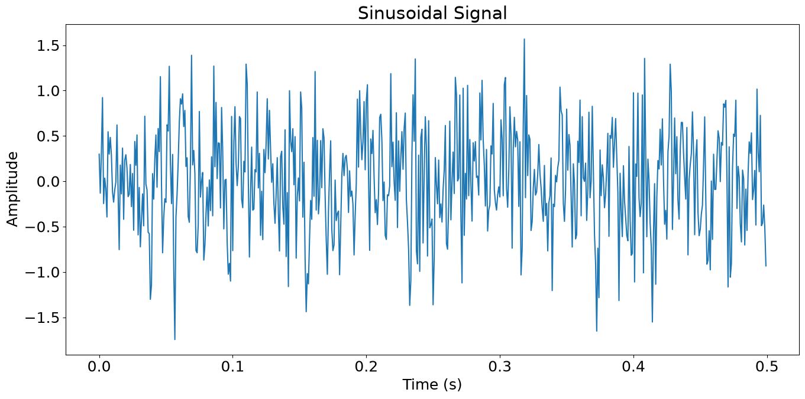
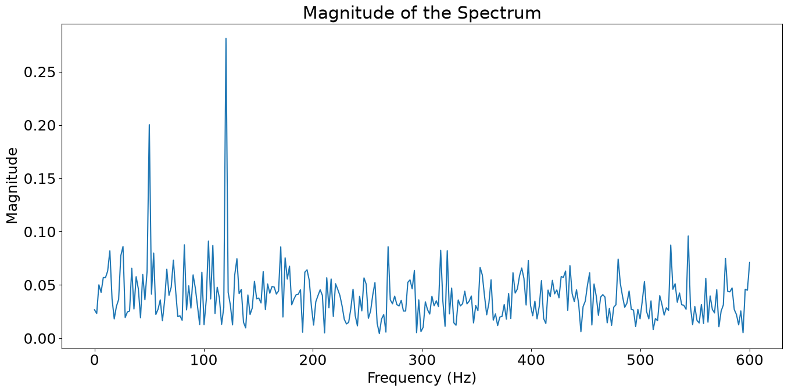

# Digital Signal Processing (DSP) - Session 6

---

## The Discrete Fourier Transform

The objective of the Discrete Fourier Transform (DFT) is to provide a **computationally convenient frequency-domain representation** of a discrete-time sequence.

Because the standard Fourier transform of an aperiodic sequence is a continuous function of frequency, it cannot be processed directly by digital hardware. The DFT solves this by **representing the sequence through samples of its spectrum**, making it a powerful tool for performing **frequency analysis** on digital signal processors and computers.

### Frequency-Domain Sampling and Reconstruction of Discrete-Time Signals

- **Objective of Sampling:** To perform frequency analysis on a digital processor, the continuous Fourier transform $X(\omega)$ must be represented by a discrete set of frequency samples. This process leads to the **Discrete Fourier Transform (DFT)**.
- **Sampling Strategy:** We take $N$ equidistant samples in the interval $0 \leq \omega < 2\pi$ with a spacing of $\delta \omega = 2\pi/N$.
    - While real signals have symmetric spectra allowing characterization within the range $[0, \pi]$, the standard DFT derivation utilizes the full $2\pi$ period.
- **Time-Domain Impact (Periodic Extension):** Sampling the spectrum in the frequency domain results in a **periodic extension** of the original time-domain sequence $x(n)$. The resulting periodic signal $x_p(n)$ is defined as: $$x_p(n) = \sum_{l=-\infty}^{\infty} x(n-lN)$$
- **Information Preservation & Aliasing:** To recover the original sequence $x(n)$ from the periodic version $x_p(n)$, we must avoid **time-domain aliasing**.
    - This is possible only if $x(n)$ is finite-duration with length $L$.
    - The number of frequency samples must satisfy **$N \ge L$** to ensure that $x(n) = x_p(n)$ for $0 \leq n \leq N-1$.
    - If $N < L$, the cycles of the periodic extension overlap, causing aliasing and loss of information.
- **Consequence for Infinite Signals:** If the signal length $L \rightarrow \infty$, then the number of samples $N$ must also approach $\infty$ to avoid aliasing. This means infinite frequency-domain samples are required to represent an infinite-duration aperiodic signal.
- **Reconstruction Formula:** If $N \ge L$, the continuous spectrum $X(\omega)$ can be reconstructed from its discrete samples $X(\frac{2\pi}{N}k)$ using the following interpolation formula: $$X(\omega) = \sum_{k=0}^{N-1} X\left(\frac{2\pi}{N}k\right) P\left(\omega - \frac{2\pi}{N}k\right)$$ where the interpolation function $P(\omega)$ is defined as: $$P(\omega) = \frac{\sin(\omega N/2)}{N \sin(\omega/2)} e^{-j\omega(N-1)/2}$$

> ***Example 1.1***
> 
> Consider the signal $$x(n) = a^n u(n), \quad 0 < a < 1$$ The spectrum of this signal is sampled at $N$ equidistant frequencies $\omega_k = 2\pi k/N$ for $k = 0, 1, \dots, N-1$. Determine the reconstructed spectra for $a = 0.8$ when $N = 5$ and $N = 50$.
> 
> *Solution*
> 
> **1. Determine the Fourier Transform of the Signal:** The Fourier transform of the infinite-duration sequence $x(n)$ is: $$X(\omega) = \sum_{n=0}^{\infty} a^n e^{-j\omega n} = \frac{1}{1 - ae^{-j\omega}}$$
> 
> **2. Evaluate Spectral Samples:** Sampling $X(\omega)$ at $N$ equidistant frequencies yields: $$X(k) \equiv X\left(\frac{2\pi k}{N}\right) = \frac{1}{1 - ae^{-j2\pi k/N}}, \quad k = 0, 1, \dots, N-1$$
> 
> **3. Identify the Corresponding Time-Domain Periodic Sequence:** The frequency samples $X(k)$ correspond to the periodic extension of $x(n)$, defined as $x_p(n) = \sum_{l=-\infty}^{\infty} x(n-lN)$. For this signal: $$x_p(n) = \sum_{l=-\infty}^{0} a^{n-lN} = a^n \sum_{l=0}^{\infty} a^{lN}$$ Evaluating the geometric series: $$x_p(n) = \frac{a^n}{1 - a^N}, \quad 0 \le n \le N-1$$
> 
> **4. Analyze the Effect of Aliasing:** The factor $\frac{1}{1 - a^N}$ represents the **effect of time-domain aliasing**.
> 
> - As $N \rightarrow \infty$, the factor approaches 1, meaning aliasing becomes negligible.
> - For **$N = 5$ and $a = 0.8$**, $1 - a^N \approx 0.672$, resulting in a significant aliasing error.
> - For **$N = 50$ and $a = 0.8$**, $1 - a^N \approx 1$, meaning aliasing is virtually nonexistent.
> 
> **5. Determine the Reconstructed Spectrum:** The Fourier transform $\hat{X}(\omega)$ of the aliased finite-duration sequence $\hat{x}(n)$ (where $\hat{x}(n) = x_p(n)$ for $0 \le n \le N-1$) is: $$\hat{X}(\omega) = \sum_{n=0}^{N-1} x_p(n) e^{-j\omega n} = \frac{1}{1 - a^N} \cdot \frac{1 - a^N e^{-j\omega N}}{1 - ae^{-j\omega}}$$
> 
> **6. Conclusion:** While $\hat{X}(\omega) \neq X(\omega)$, they are **identical at the sample points** $\omega_k = 2\pi k/N$. When $N=5$, the reconstructed spectrum is a poor approximation due to aliasing; when $N=50$, it closely matches the original continuous spectrum.

### The Discrete Fourier Transform (DFT)

The DFT provides a **computationally convenient frequency-domain representation** for discrete-time sequences, allowing frequency analysis to be performed on digital hardware.

#### Mathematical Definition

The DFT maps a sequence $x(n)$ of length $L$ into a sequence of frequency samples $X(k)$ of length $N$, where $N \ge L$.

- **DFT (Analysis Equation):** $$X(k) = \sum_{n=0}^{N-1} x(n)e^{-j2\pi kn/N}, \quad k = 0, 1, \dots, N-1 \quad$$
- **IDFT (Synthesis Equation):** $$x(n) = \frac{1}{N} \sum_{k=0}^{N-1} X(k)e^{j2\pi kn/N}, \quad n = 0, 1, \dots, N-1 \quad$$

#### Derivation and Frequency Sampling

The DFT is derived by **sampling the continuous Fourier transform** $X(\omega)$ at $N$ equidistant frequencies $\omega_k = \frac{2\pi k}{N}$.

- **Time-Domain Impact:** Sampling in frequency results in a **periodic extension** of the original signal: $$x_p(n) = \sum_{l=-\infty}^{\infty} x(n-lN)$$
- **Aliasing Condition:** To recover the original sequence $x(n)$ from these samples, the number of samples $N$ must satisfy **$N \ge L$** to avoid **time-domain aliasing**.
- **Reconstruction:** If $N \ge L$, the continuous spectrum $X(\omega)$ can be reconstructed from the DFT samples $X(k)$ using an **interpolation formula**.

#### Relationship to Other Transforms

- **Fourier Transform:** The DFT coefficients are samples of the continuous Fourier transform: $$X(k) = X(\omega)|_{\omega = 2\pi k/N}$$
- **Z-Transform:** The DFT corresponds to $N$ samples of the $z$-transform taken at **equidistant points on the unit circle**: $$z_k = e^{j2\pi k/N}$$
- **Fourier Series:** The formula for the Fourier series coefficients of a periodic sequence $x_p(n)$ is identical in form to the DFT.

> ***Example 1.2***
> 
> Determine the $N$-point DFT of a finite-duration rectangular pulse sequence of length $L$ defined as: $$x(n) = \begin{cases} 1, & 0 \leq n \leq L-1 \\ 0, & \text{otherwise} \end{cases}$$ Assume the transform length $N$ satisfies $N \ge L$.
> 
> *Solution*
> 
> **1. Determine the Fourier Transform** First, find the continuous Fourier transform $X(\omega)$ of the sequence: $$X(\omega) = \sum_{n=0}^{L-1} x(n)e^{-j\omega n} = \sum_{n=0}^{L-1} e^{-j\omega n}$$ Using the finite geometric series formula: $$X(\omega) = \frac{1- e^{-j\omega L}}{1- e^{-j\omega}} = \frac{\sin(\omega L/2)}{\sin(\omega/2)} e^{-j\omega(L-1)/2}$$
> 
> **2. Sample the Spectrum** The $N$-point DFT is obtained by evaluating $X(\omega)$ at $N$ equally spaced frequencies $\omega_k = \frac{2\pi k}{N}$ for $k = 0, 1, \dots, N-1$: $$X(k) = X(\omega) \Big|_{\omega = \frac{2\pi k}{N}} = \frac{1- e^{-j2\pi kL/N}}{1- e^{-j2\pi k/N}}$$ $$X(k) = \frac{\sin(\pi kL/N)}{\sin(\pi k/N)} e^{-j\pi k(L-1)/N}, \quad k = 0, 1, \dots, N-1$$
> 
> **3. Analyze Special Case: $N = L$** If the transform length $N$ is exactly equal to the pulse length $L$, the DFT simplifies significantly: $$X(k) = \begin{cases} L, & k = 0 \\ 0, & k = 1, 2, \dots, L-1 \end{cases}$$ This occurs because the samples are taken at the zero-crossings of the $(\sin \phi)/\sin \theta$ envelope, except at $k=0$ (the DC component).
> 
> **4. Visual Characteristics**
> 
> - **Magnitude:** Follows a periodic sinc-like envelope ($| \sin(N \theta) / \sin \theta |$).
> - **Phase:** Shows a linear phase shift corresponding to the time-domain delay.
> - **Zero Padding:** Increasing $N$ (e.g., $N=50$ or $N=100$ for $L=10$) does not change the underlying spectrum but provides a **finer interpolation** and a clearer display of the continuous Fourier transform characteristics.

### Properties of DFT

The Discrete Fourier Transform (DFT) possesses several key mathematical properties that are essential for frequency analysis and digital filtering.

- **Periodicity**: Both the time-domain sequence $x(n)$ and its frequency-domain representation $X(k)$ are implicitly **periodic with period $N$** when extended beyond their primary ranges:
    
    - $x(n+N) = x(n)$ for all $n$.
    - $X(k+N) = X(k)$ for all $k$.
- **Linearity**: The DFT is a **linear transformation**. If $x_1(n) \leftrightarrow X_1(k)$ and $x_2(n) \leftrightarrow X_2(k)$, then for any constants $a_1$ and $a_2$: $$a_1x_1(n) + a_2x_2(n) \xrightarrow[N]{\text{DFT}} a_1X_1(k) + a_2X_2(k)$$
    
- **Circular Symmetries of a Sequence**: Since the $N$-point DFT treats a sequence as if it were one period of a periodic signal, operations are performed using **modulo $N$ arithmetic**.
    
    - **Circular Shift:** Shifting a sequence $x(n)$ circularly by $k$ units is defined as $x((n-k))_N$. This is equivalent to a linear shift of its periodic extension.
    - **Circularly Even:** A sequence is circularly even if $$x(N-n) = x(n), \quad 1 \leq n \leq N-1$$
    - **Circularly Odd:** A sequence is circularly odd if $$x(N-n) = -x(n), \quad 1 \leq n \leq N-1$$
    - **Time Reversal:** Reversing a sequence on the circle is $$x(( -n ))_N = x(N-n)$$
- **Circular Convolution**: Multiplication of two $N$-point DFTs is equivalent to the **circular convolution** of the two sequences in the time domain: $$x_1(n) \circledast x_2(n) \xrightarrow[N]{\text{DFT}} X_1(k)X_2(k)$$ This property is fundamental for performing linear filtering in the frequency domain, provided the sequences are properly padded with zeros to avoid time-domain aliasing.

### Additional DFT Properties

- **Time Reversal of a Sequence:** $$x(( -n ))_N \leftrightarrow X(( -k ))_N = X(N-k)$$
- **Circular Time Shift:** $$x(( n-l ))_N \leftrightarrow X(k) e^{-j 2\pi kl/N}$$
- **Circular Frequency Shift:** $$x(n) e^{j 2\pi ln/N} \leftrightarrow X(( k-l ))_N$$
- **Complex-Conjugate Properties:** $$x^*(n) \leftrightarrow X^*(N-k)$$ and $$x^*(N-n) \leftrightarrow X^*(k)$$
- **Circular Correlation:** $$r_{xy}(l) = \sum_{n=0}^{N-1} x(n) y^*((n-l))_N \leftrightarrow X(k) Y^*(k)$$
- **Multiplication of Two Sequences:** $$x_1(n)x_2(n) \leftrightarrow \frac{1}{N} X_1(k) \circledast X_2(k)$$ (Circular Frequency Convolution).
- **Parseval’s Theorem:** Relates the energy in the time domain to the energy in the frequency domain: $$\sum_{n=0}^{N-1} |x(n)|^2 = \frac{1}{N} \sum_{k=0}^{N-1} |X(k)|^2$$

### Filtering of Long Data Sequences

Because linear filtering via the DFT requires operations on blocks of data, long input sequences must be segmented into fixed-size blocks to accommodate limited computer memory.

- **Overlap-save method**
    
    - **Block Formation:** Input blocks have a size of $N = L + M - 1$, consisting of $L$ new points preceded by the last $M - 1$ points of the previous block.
    - **Initialization:** The first $M - 1$ points of the very first block are set to zero.
    - **Filtering:** Multiplies the $N$-point DFT of the input block by the $N$-point DFT of the zero-padded impulse response.
    - **Output Handling:** The first $M - 1$ points of each $N$-point IDFT result are discarded due to corruption by time-domain aliasing; the remaining $L$ points are saved as the correct convolution result.
- **Overlap-add method**
    
    - **Block Formation:** Input blocks consist of $L$ data points.
    - **Padding:** Each block is appended with $M - 1$ zeros to reach a total size of $N = L + M - 1$ before taking the DFT.
    - **Filtering:** Multiplies the $N$-point DFTs; the resulting $N$-point IDFT blocks are free of aliasing.
    - **Output Handling:** To form the final sequence, the last $M - 1$ points of each output block are **overlapped and added** to the first $M - 1$ points of the succeeding block.

---

## Efficient Computation of DFT: Fast Fourier Transform

### Direct Computation of the DFT

Direct computation of the DFT is the most straightforward but least efficient method for performing frequency analysis on a sequence.

#### Computational Complexity

For a sequence of length $N$:

- **Per DFT point ($X(k)$):** Requires $N$ complex multiplications and $N-1$ complex additions.
- **For all $N$ points:** Requires $N^2$ complex multiplications and $N^2 - N$ complex additions.

#### Real-Valued Operations

When implemented using real-valued arithmetic for a complex-valued sequence $x(n)$, the process requires:

1. **$2N^2$ evaluations** of trigonometric functions (sine and cosine).
2. **$4N^2$ real multiplications**.
3. **$4N(N-1)$ real additions**.
4. Numerous indexing and addressing operations to fetch data and store results.

#### Mathematical Representation

For a complex sequence $x(n) = x_R(n) + jx_I(n)$, the real and imaginary parts of the DFT $X(k)$ are calculated as:

$$X_R(k) = \sum_{n=0}^{N-1} \left[ x_R(n) \cos \frac{2\pi kn}{N} + x_I(n) \sin \frac{2\pi kn}{N} \right]$$

$$X_I(k) = -\sum_{n=0}^{N-1} \left[ x_R(n) \sin \frac{2\pi kn}{N} - x_I(n) \cos \frac{2\pi kn}{N} \right]$$


### Divide-and-Conquer Approach to Computation of the DFT

The divide-and-conquer approach is the foundation for efficient **Fast Fourier Transform (FFT)** algorithms. It works by decomposing an $N$-point DFT into smaller, successively computed DFTs.

The phase factor $W_N$ is defined as: $$W_N = e^{-j2\pi/N}$$

Using this notation, the DFT and IDFT formulas are expressed as:

- **DFT:** $$X(k) = \sum_{n=0}^{N-1} x(n) W_N^{kn}, \quad 0 \le k \le N-1$$
- **IDFT:** $$x(n) = \frac{1}{N} \sum_{k=0}^{N-1} X(k) W_N^{-kn}, \quad 0 \le n \le N-1$$

**Core Methodology**

1. **Factorization:** If $N$ is composite (e.g., $N = LM$), the 1D sequence is mapped into a 2D array.
2. **Recursive Decomposition:** Large DFTs are broken into smaller $M$-point and $L$-point DFTs.
3. **Complexity Reduction:** This approach reduces the computational burden from **$N^2$** complex multiplications to approximately **$N(M + L + 1)$**. When $N$ is a power of 2 (radix-2), this complexity drops further to **$\frac{N}{2} \log_2 N$**.

The efficiency of FFT algorithms relies on exploiting the following two properties of $W_N$:

- **Periodicity Property:** $$W_N^{k+N} = W_N^k$$

	*Proof:* $$W_N^{k+N} = e^{-j\frac{2\pi}{N}(k+N)}$$ $$W_N^{k+N} = e^{-j\frac{2\pi k}{N}} \cdot e^{-j2\pi}$$
	
	Since $e^{-j2\pi} = \cos(2\pi) - j\sin(2\pi) = 1$: $$W_N^{k+N} = W_N^k \cdot 1 = W_N^k$$

- **Symmetry Property:** $$W_N^{k+N/2} = -W_N^k$$
	
	*Proof:* $$W_N^{k+N/2} = e^{-j\frac{2\pi}{N}(k+N/2)}$$ $$W_N^{k+N/2} = e^{-j\frac{2\pi k}{N}} \cdot e^{-j\pi}$$
	
	Since $e^{-j\pi} = \cos(\pi) - j\sin(\pi) = -1$: $$W_N^{k+N/2} = W_N^k \cdot (-1) = -W_N^k$$

### Radix-2 FFT Algorithms

Radix-2 algorithms are the most widely used Fast Fourier Transform (FFT) methods, applicable when the number of data points $N$ is a power of 2 ($N = 2^{\nu}$). These algorithms use a **divide-and-conquer approach** to decompose an $N$-point DFT into successively smaller DFTs.

#### Decimation-in-Time (DIT) Algorithm

- **Mechanism:** The $N$-point input sequence is split into two $N/2$-point sequences: $f_1(n)$ (even-numbered samples) and $f_2(n)$ (odd-numbered samples).
- **Mathematical Decomposition:** The $N$-point DFT $X(k)$ is expressed through the $N/2$-point DFTs of the decimated sequences ($F_1(k)$ and $F_2(k)$):

	$$X(k) = F_1(k) + W_N^k F_2(k), \quad k = 0, \dots, \frac{N}{2}-1$$
	
	$$X(k + \frac{N}{2}) = F_1(k) - W_N^k F_2(k), \quad k = 0, \dots, \frac{N}{2}-1$$

- **Recursive Process:** This decimation is repeated $\nu = \log_2 N$ times until the sequences are reduced to one-point samples.
- **Input Shuffling:** To compute the DFT in place, the input data must be stored in **bit-reversed order**.

#### Decimation-in-Frequency (DIF) Algorithm

- **Mechanism:** Instead of decimating the input sequence, this approach decimates the output DFT sequence into even-numbered and odd-numbered samples.
- **Strategy:** The input $x(n)$ is split into the first $N/2$ points and the last $N/2$ points.
- **Resulting Order:** The input sequence typically occurs in natural order, but the resulting output DFT sequence is in **bit-reversed order**.

#### Computational Characteristics

- **Butterfly Operation:** The basic computational unit is the "butterfly," which takes two complex numbers, multiplies one by a phase factor ($W_N^r$), and then adds and subtracts the results.
- **Total Complexity:**
    - **Complex Multiplications:** $(N/2) \log_2 N$.
    - **Complex Additions:** $N \log_2 N$.
- **In-Place Computation:** Both algorithms allow results to be stored in the same memory locations as the inputs, requiring only $2N$ storage registers for complex numbers.


> ***Table 1 Comparison of Computational Complexity for the Direct Computation of the DFT Versus the FFT Algorithm***
> 
> 1. **Mathematical Basis**
> 
> 	- **Direct DFT Complexity:** Defined as **$N^2$** complex multiplications.
> 	- **Radix-2 FFT Complexity:** Defined as **$(N/2) \log_2 N$** complex multiplications.
> 	- **Speed Improvement Factor:** Defined as the ratio between the two: **$\frac{2N}{\log_2 N}$**.
> 
> 2. **Key Observations**
> 
> 	- **Quadratic vs. Logarithmic Growth:** While direct computation grows quadratically ($N^2$), the FFT grows much more slowly ($N \log N$), making high-point transforms feasible on digital hardware.
> 	- **Widening Efficiency Gap:** As $N$ increases, the efficiency of the FFT becomes exponentially more significant. The speed improvement factor jumps from **4.0** (at $N=4$) to **204.8** (at $N=1,024$).
> 	- **Practical Impact:** For a 1,024-point sequence, direct computation requires over **1 million** multiplications, while the FFT requires only **5,120**.
> 
> 3. **Selected Data Comparison**
> 
> 	|$N$ (Points)|Direct ($N^2$)|FFT ($\frac{N}{2} \log_2 N$)|Speed Improvement|
> 	|:--|:--|:--|:--|
> 	|**16**|256|32|8.0|
> 	|**64**|4,096|192|21.3|
> 	|**256**|65,536|1,024|64.0|
> 	|**1,024**|1,048,576|5,120|**204.8**|


---

## Implement the DFT and FFT in Python

### Implement the DFT

Define a function `dft` to manually compute the Discrete Fourier Transform (DFT) of a given signal `x`, then use with a simple example signal `[2, 1]`.

```python
import numpy as np

def dft(x):
    N = len(x)
    X = np.zeros(N, dtype=complex)
    for k in range(N):
        for n in range(N):
            X[k] += x[n] * np.exp(-2j * np.pi * k * n / N)
    return X

# Example signal
x = np.array([2, 1])

# Compute DFT
X_manual = dft(x)

print(X_manual)
```

**Output:**

```
[3.+0.0000000e+00j 1.-1.2246468e-16j]
```

*Note: The result is due to floating-point precision.*

### Use NumPy's built-in FFT function

Use NumPy's built-in Fast Fourier Transform (FFT) function, `np.fft.fft`, to compute the FFT of the same example signal `[2, 1]` for comparison.

```python
import numpy as np

# Example signal
x = np.array([2, 1])

# Compute FFT
X_fft = np.fft.fft(x)
print(X_fft)
```

**Output:**

```
[3.+0.j 1.+0.j]
```

### Plot the time domain

Plot the time domain of a sinusoidal signal with two different frequencies and add some random noise to it.

```python
import matplotlib.pyplot as plt
from scipy.fftpack import fft
import numpy as np
from math import pi

plt.close('all')

plt.rcParams['figure.figsize']=[16,16]
plt.rcParams.update({'font.size':18})

fs = 1200 # Sampling Frequency
t = np.arange(0,0.5,1/fs) # Time axis in sec.
f1 = 120 # frequency of the sine wave is 20Hz or discrete frequency = 2pi/6
f2 = 50 # frequency of the sine wave is 20Hz or discrete frequency = 2pi/3
x = 0.3*np.sin(2*pi*f1*t) + 0.2*np.sin(2*pi*f2*t)
x = x + 0.5*np.random.randn(len(t))

plt.subplot(2,1,1)
plt.plot(t,x)
plt.title('Sinusoidal Signal')
plt.xlabel('Time (s)')
plt.ylabel('Amplitude')
```

**Output:**



### Plot the magnitude spectrum

Calculate the frequency axis for the spectrum, compute the FFT of the generated signal `x` using `scipy.fftpack.fft`, and then calculate the magnitude of the spectrum, then plot the magnitude spectrum, showing the frequency components of the signal.

```python
# Generate freqeuncy axis
n = np.size(t)
# We just need half of the samples in frequency domain since the signal is real-valued
fr = (fs/2)*np.linspace(0,1,int(n/2))
# Compute FFT of x
X = fft(x)
# Magnitude of the FFT
X_mag = 2/n * np.abs(X[0:np.size(fr)])

plt.subplot(2,1,2)
plt.plot(fr, X_mag)
plt.title('Magnitude of the Spectrum')
plt.xlabel('Frequency (Hz)')
plt.ylabel('Magnitude')
plt.show()
```

**Output:**


