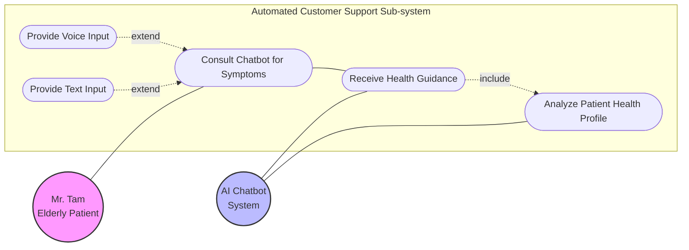
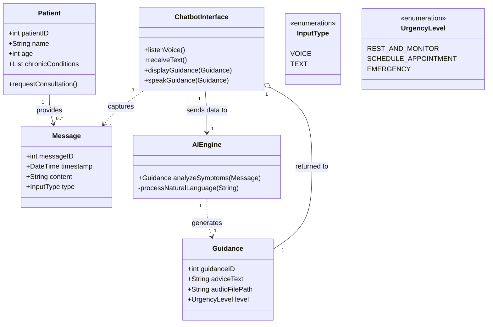
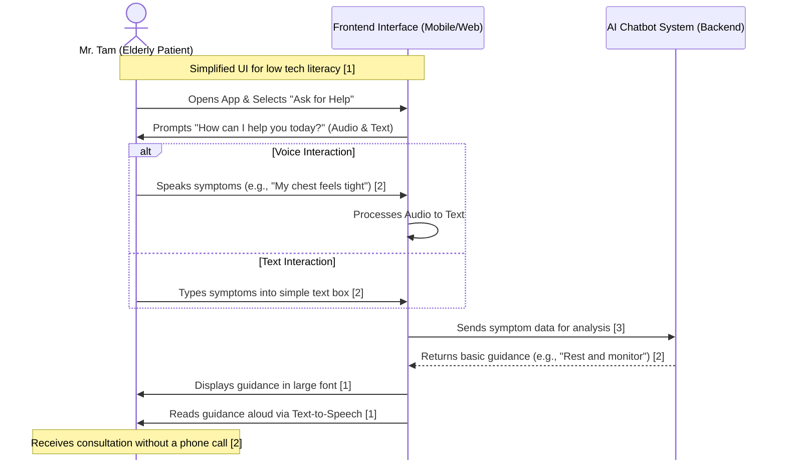

# Sprint 1 Story 1 Diagrams

## User Story

[[Mr. Tam the Elderly Patient]] => ask chatbot about symptoms via voice or text => get basic guidance without phone call

## Use Case Diagram

## Class Diagram

## Sequence Diagram

