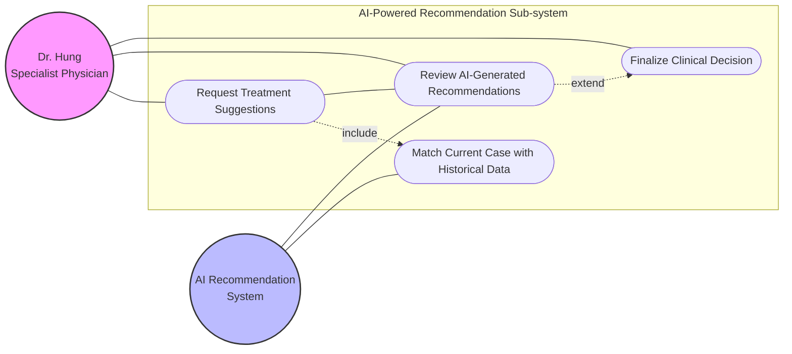
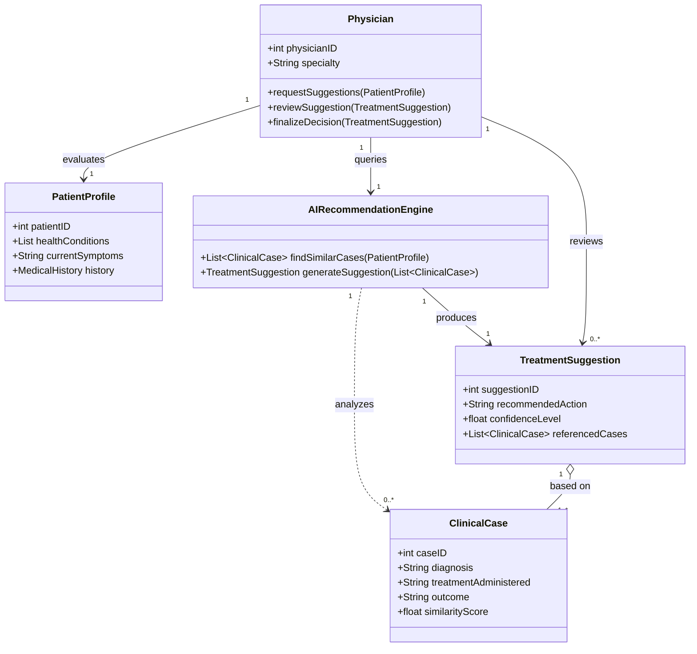
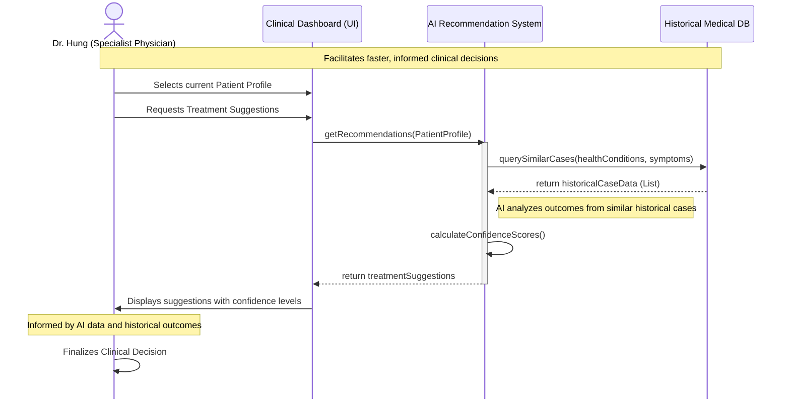

# Story 2 UML

## User Story

[[Dr. Hung the Specialist Physician]] => see treatment suggestions based on similar cases => make faster and more informed clinical decisions.

## Use Case Diagram

## Class Diagram

## Sequence Diagram

