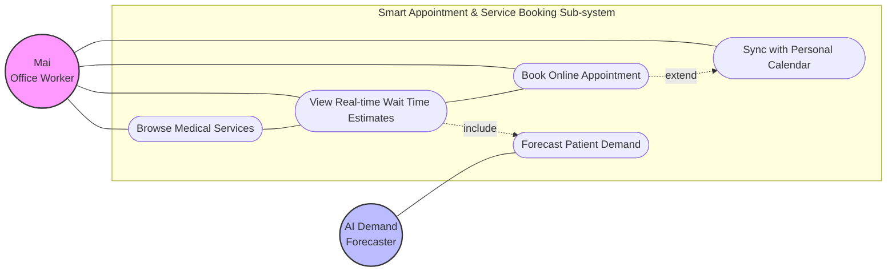
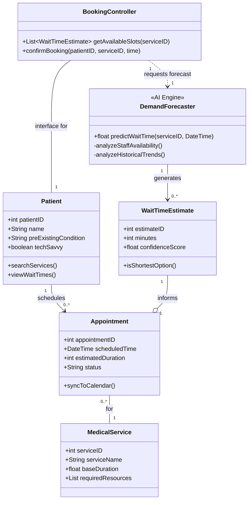
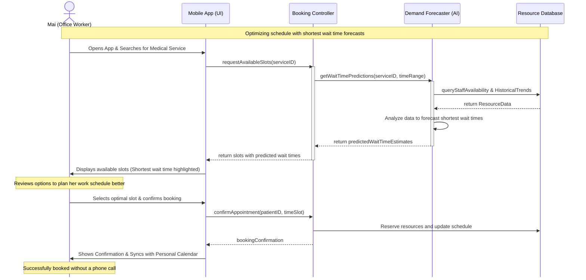

# Story 3 UML

## User Story

[[Mai the Busy Office Worker]] => book appointment online with shortest expected wait time => plan work schedule better.

## Use Case Diagram

## Class Diagram

## Sequence Diagram

