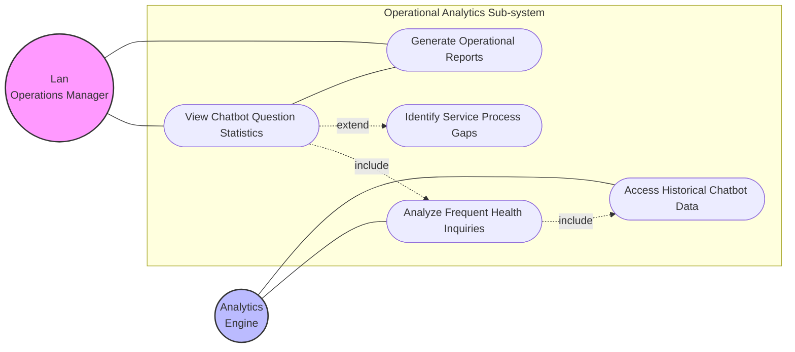
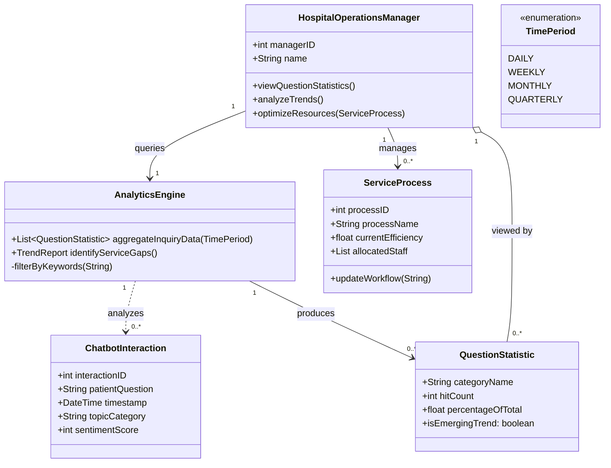
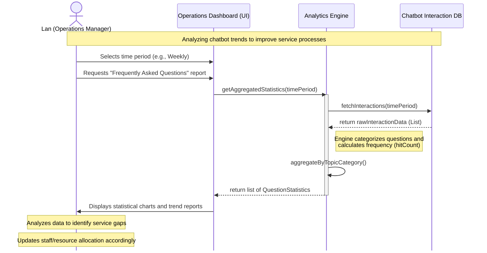

# Story 4 UML

## User Story

[[Lan the Hospital Operations Manager]] => view statistics on the most frequently asked chatbot questions => improve service processes

## Use Case Diagram

## Class Diagram

## Sequence Diagram

