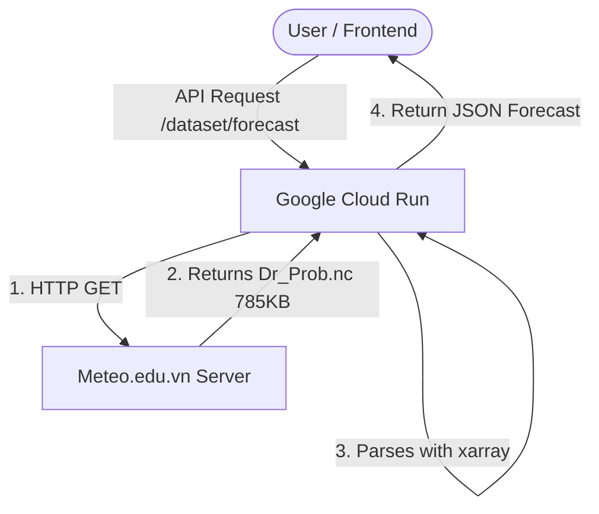
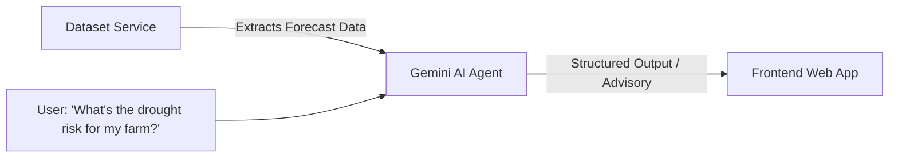

# REMOCLIC v2: Cloud Migration & AI Integration Feasibility Report

This report presents a thorough investigation into migrating the **REMOCLIC v2** backend to **Google Cloud Run** and integrating it with **Google AI Studio**.

---

## Executive Summary

Migrating **REMOCLIC v2** to **Google Cloud Run** is not only possible but **highly recommended**. The current lightweight FastAPI architecture, stateless design, and existing containerization make it an ideal candidate for serverless deployment. 

Furthermore, integrating the backend with **Google AI Studio (Gemini API)** opens up powerful avenues to transform raw, technical NetCDF meteorological data into natural, actionable climate advisories using modern AI agents.

### Key Metrics & Findings
* **NetCDF File Size:** **785.3 KB** (0.78 MB) — extremely lightweight.
* **Cold Start Latency:** Negligible data-download overhead (~0.2s download time), meaning high-speed cold starts.
* **Serverless Cost:** Extremely low. The app will easily fit into the **Google Cloud Free Tier** under low-to-moderate traffic.

---

## 1. Google Cloud Run Deployment Analysis

Google Cloud Run is a fully managed, serverless platform that runs containerized applications. Here is how the REMOCLIC v2 backend fits:

### Technical Feasibility & Advantages

1. **Seamless Containerization:**
   The codebase already has a well-structured `Dockerfile` using `python:3.11-slim` and installing all required libraries (`xarray`, `netCDF4`, `fastapi`, `requests`). This works out-of-the-box on Cloud Run.
2. **Minimal Resource Requirements:**
   Our live probe determined that the target NetCDF file (`Dr_Prob.nc`) is only **785 KB**. 
   * *Memory Overhead:* Downloading a file of this size to Cloud Run’s in-memory `/tmp` filesystem and loading it with `xarray` requires very little memory (~100–150 MB total including the FastAPI overhead).
   * *Recommended Provisioning:* **512 MB RAM** and **1 vCPU** is more than enough, making the hosting costs negligible.
3. **Stateless Compliance:**
   The `NetCDFRepository` downloads the file, loads the data into memory, and immediately deletes the temporary file from `/tmp`. This conforms perfectly to Cloud Run's stateless requirements.

### Key Considerations & Optimizations

> [!NOTE]
> **Per-Instance Caching**
> The `NetCDFRepository` uses a class-level variable `_cached_file_url` to cache the latest URL path. On Cloud Run, instances scale horizontally and dynamically. Each container instance will manage its own in-memory cache. With a 785 KB file, this redundant lookup is harmless, but for large-scale production, a shared cache (such as Google Cloud Storage or Memorystore Redis) or a time-to-live (TTL) cache could be implemented.

> [!TIP]
> **Cold Start Optimization**
> When Cloud Run scales from 0 to 1, the first request will trigger:
> 1. Container startup.
> 2. An HTTP handshake to discover the latest subdirectory.
> 3. Downloading the 785 KB NetCDF file.
> 
> To minimize latency for the end-user:
> * Keep `min-instances = 1` if instantaneous responses are critical.
> * Use **FastAPI Startup Events** (`lifespan` handler) to run the directory discovery during container startup rather than delaying the first user request.

---

## 2. Leveraging Google AI Studio & AI Agents

Google AI Studio provides instant access to the Gemini 1.5 family (Pro and Flash). Integrating these AI capabilities can dramatically enhance the product value.

### Innovative AI Features to Implement

#### 1. Conversational Climate Advisories (Gemini 1.5 Flash)
Instead of displaying dry numbers or charts for `mild`, `moderate`, and `severe` drought probabilities, you can pass these arrays to Gemini 1.5 Flash to generate highly localized, empathetic, and actionable advisories:
* *Example Input:* `{lat: 21.02, lng: 105.83, mild: [0.1, 0.2, 0.5], seve: [0.0, 0.0, 0.1]}`
* *AI Output:* *"Hanoi is seeing a gradual rise in mild drought conditions over the next 3 months, with severe levels remaining very low. Farmers should consider scheduling early irrigation, but critical water shortages are not expected."*

#### 2. Natural Language Querying (Function Calling / Tool Use)
By giving Gemini access to the API endpoints as "Tools", users can ask:
> *"Is there any severe drought risk in Son La province in July?"*
Gemini will automatically translate "Son La" to lat/lng, trigger the `/dataset/forecast` API, parse the resulting JSON, and return a plain-language answer.

#### 3. Deep Pattern & Anomaly Detection
Gemini’s massive context window and reasoning capabilities can be used to compare current forecast structures with historical trends, flagging sudden shifts or anomalies that standard threshold-based algorithms miss.

---

## 3. Accelerating Development with Google AI Tools

Moving the project development workspace to **Project IDX** (Google's AI-native browser IDE) or utilizing **Gemini Code Assist** offers several developer-experience advantages:

* **Instant Environment Provisioning:** IDX configures the Python virtual environment and system dependencies automatically in a containerized environment.
* **One-Click Cloud Run Deployment:** IDX includes built-in integrations to build the Docker image and deploy it directly to Google Cloud Run in a single click.
* **Context-Aware Coding Agents:** Using Gemini in the workspace allows developers to generate FastAPI route decorators, write test cases, or refactor `xarray` data cleaning operations (`_clean_vals`) on the fly.

---

## Conclusion & Next Steps

Migrating **REMOCLIC v2** to **Google Cloud Run** and integrating **Google AI Studio** is an **excellent and highly viable path**. 

### Recommended Action Plan

1. **Container Deployment:** Deploy the existing Docker container directly to Google Cloud Run using the Google Cloud CLI or Project IDX.
2. **Setup AI Studio:** Create a project in Google AI Studio, grab a free API key, and add `GEMINI_API_KEY` to the `.env` settings.
3. **Enhance API with AI:** Create a new `/dataset/forecast/summary` route that fetches the forecast, formats a prompt, calls Gemini 1.5 Flash, and returns a natural-language climate advisory.
