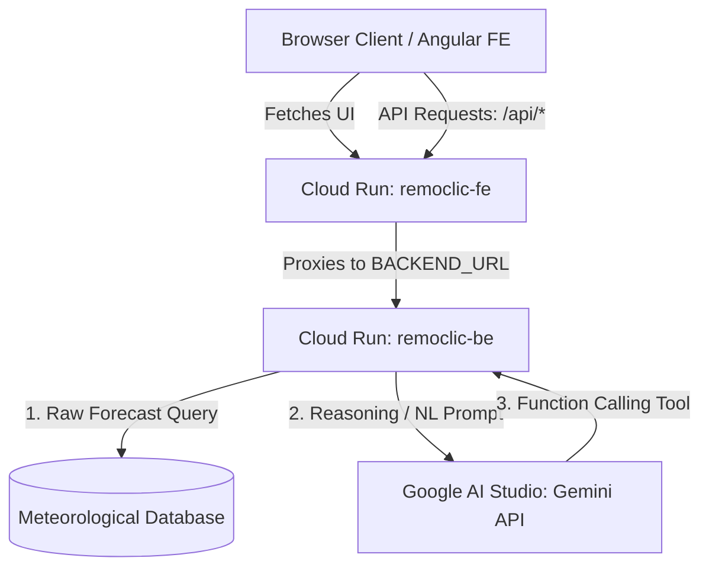
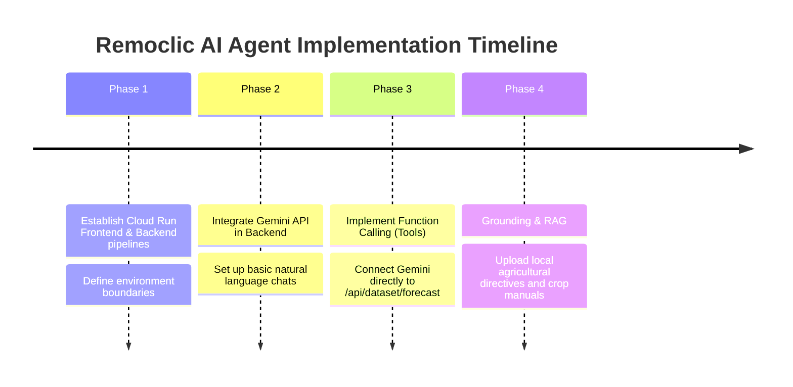

# Remoclic V2: Google Cloud Run Deployment & Google AI Studio Integration Report

This report presents a thorough technical feasibility study and architectural proposal for moving the **Remoclic V2** meteorological forecast application to **Google Cloud Run** and integrating it with **Google AI Studio** to leverage Google's state-of-the-art **Gemini AI Agents**.

---

## Executive Summary

- **Cloud Run Deployment**: **100% Feasible and Ideal.** The codebase is already containerized using a multi-stage Docker build with Nginx. It is stateless and dynamically maps the `PORT` environment variable, aligning perfectly with Cloud Run's requirements.
- **Google AI Studio Integration**: **Highly Recommended.** Google AI Studio provides API keys and playground access to Gemini models (e.g., Gemini 1.5 Flash / Pro). By integrating Gemini into the backend, you can build powerful AI agents that can query, analyze, and explain complex meteorological forecasts.
- **Complexity**: **Low-to-Medium Effort.** The frontend is well-structured in Angular 21. Creating a companion backend microservice for AI Agent operations and deploying both to Cloud Run can be achieved in a highly modular fashion.

---

## 1. Deploying to Google Cloud Run

Google Cloud Run is a fully managed, serverless platform that automatically scales containerized applications.

### Why Remoclic is a Perfect Match for Cloud Run:
1. **Dynamic Port Binding**: Cloud Run injects a dynamic `PORT` environment variable (typically `8080`) and expects the container to listen on it. Your [Dockerfile](file:///c:/Users/slamd/WebstormProjects/remoclic-v2-fe/Dockerfile) and [nginx.conf.template](file:///c:/Users/slamd/WebstormProjects/remoclic-v2-fe/nginx.conf.template) already implement this:
   ```nginx
   server {
       listen ${PORT};
       ...
   }
   ```
2. **Stateless Frontend**: Serving compiled Angular files through Nginx is a completely stateless operation. Cloud Run can scale this to **zero instances** when there is no traffic (saving 100% of idle costs) and scale up instantly to handle thousands of requests.
3. **Environment-driven Proxying**: Your Nginx template proxies `/api/` requests to `${BACKEND_URL}`. On Cloud Run, you can deploy your backend as a separate serverless service, copy its URL, and inject it into the frontend's environment. Nginx will handle the routing cleanly and securely.

### Proposed Multi-Service Cloud Run Architecture:



### Actionable Deployment Workflow:
1. **Containerize & Build**:
   Build the Docker image locally or using Google Cloud Build:
   ```bash
   gcloud builds submit --tag gcr.io/[PROJECT_ID]/remoclic-fe:latest .
   ```
2. **Deploy to Cloud Run**:
   Run the deployment command, exposing the web app publicly and setting the backend URL pointing to your API service:
   ```bash
   gcloud run deploy remoclic-fe \
     --image gcr.io/[PROJECT_ID]/remoclic-fe:latest \
     --platform managed \
     --region us-central1 \
     --allow-unauthenticated \
     --set-env-vars BACKEND_URL=https://remoclic-be-[hash]-uc.a.run.app
   ```

---

## 2. Integrating Google AI Studio & AI Agent Features

> [!NOTE]
> **Clarification**: Google AI Studio is a developer environment and API suite for prototyping with the Gemini model family; it is *not* a hosting platform. You deploy your application code (frontend and backend) to Cloud Run, and your backend makes API calls to Google AI Studio (or Vertex AI) using a secure API key.

By leveraging **Gemini 1.5 Pro** and **Gemini 1.5 Flash** models, you can elevate Remoclic from a passive dashboard to an active, conversational, and analytical meteorological agent.

### Core AI Agent Capabilities for Remoclic:

#### 1. Function Calling (Tool Use) for Smart Queries
Instead of users navigating complex dropdowns, they can speak or type. The AI Agent can bridge the gap using **Function Calling**.
- **How it works**: You define a tool schema in your backend for `getForecast(lat, lng)`.
- **Flow**:
  1. The user asks: *"What is the drought risk for my farm near Sóc Trăng in the next few months?"*
  2. Gemini recognizes the request, resolves "Sóc Trăng" to coordinates (via a geocoding API tool or internal knowledge), and issues a structured **tool call**: `getForecast(lat: 9.60, lng: 105.97)`.
  3. Your backend executes the local database query and returns the raw JSON.
  4. Gemini processes the raw forecast (mild, moderate, and severe drought probabilities) and explains it:
     > *"Based on the latest forecast models for Sóc Trăng, there is a moderate drought probability rising to 65% in Month 3, peaking at a severe drought risk of 80% in Month 5. I recommend reviewing your water storage capacity immediately."*

#### 2. Multimodal Dashboards & Visual Explanation
Gemini is native-multimodal. It can process both text and visual inputs simultaneously.
- **Use Case**: Farmers or local government officials can upload a screenshot of their local crop layout or a custom dashboard graph. The AI Agent can examine the visual graph from Chart.js, correlate it with raw data, and write localized reports.

#### 3. Grounding with Retrieval-Augmented Generation (RAG)
Meteorological data alone does not tell a farmer what to do. By grounding Gemini with local agronomy manuals, government circulars, and water-management guidelines, your agent can provide highly accurate, actionable solutions.
- **Example**: If the forecast shows a high probability of severe drought in the Mekong Delta, the grounded agent can recommend:
  - Transitioning to salt-tolerant rice varieties (e.g., ST24 or ST25).
  - Timing the harvest before saline intrusion peaks.
  - Sourcing local government subsidies or water truck schedules.

---

## 3. Recommended Next Steps

To make this a reality, we suggest a phased development plan:



1. **Backend Separation**: Ensure you have a lightweight backend (e.g., Node.js/Express, Python/FastAPI, or Go) ready. If you already have one, verify it is Dockerized.
2. **Setup AI Studio Key**: Obtain an API Key from [Google AI Studio](https://aistudio.google.com/) and save it securely in Google Cloud **Secret Manager**. Mount it directly into your Cloud Run backend container.
3. **Build the AI Assistant Component**: 
   Add a sleek, floating chat bubble or sidebar to the Angular frontend (styled with Angular Material icons and smooth transitions) allowing users to chat with the "Remoclic AI Meteorologist".

---

### Verdict
Moving Remoclic to **Google Cloud Run** and integrating it with **Google AI Studio** is a **highly strategic, modern, and easily achievable path**. It transforms your app from a standard visualization page into an interactive, smart decision-support system that can truly wow users.
