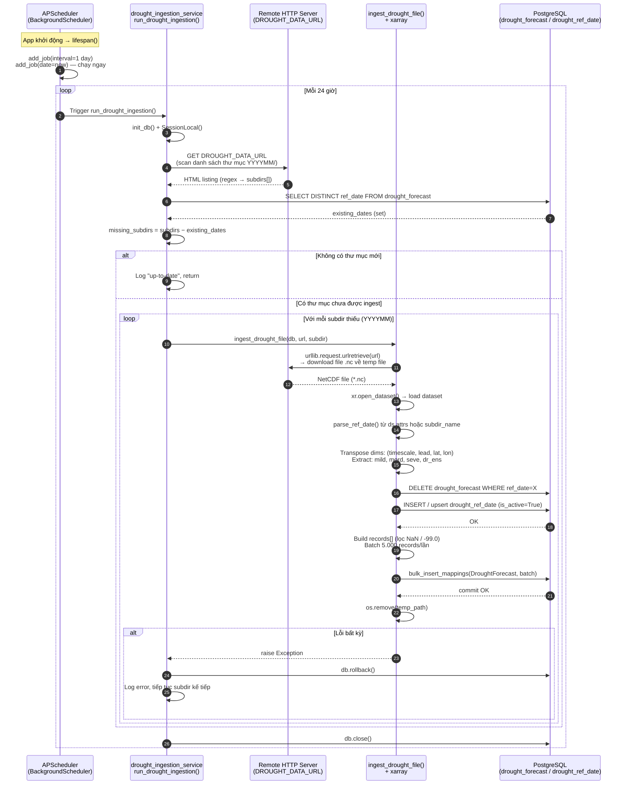
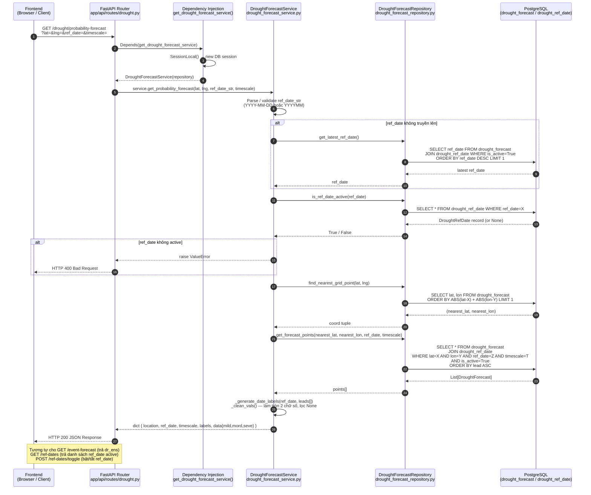
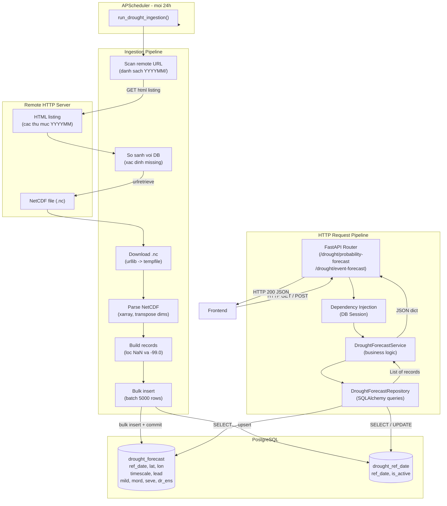

# Sơ đồ luồng hệ thống Dự báo Hạn hán

---

## 1. Luồng Crawl Dữ liệu (Data Ingestion)

> Tự động chạy **1 lần/ngày** (APScheduler `interval days=1`) và **1 lần ngay khi khởi động** (`date` job).

---

## 2. Luồng Xử lý HTTP Request (Dự báo Hạn hán)

> Frontend gọi API → FastAPI router → Service → Repository → PostgreSQL → trả JSON về Frontend.

---

## Kiến trúc tổng quan

